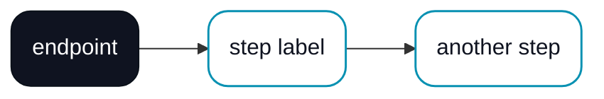
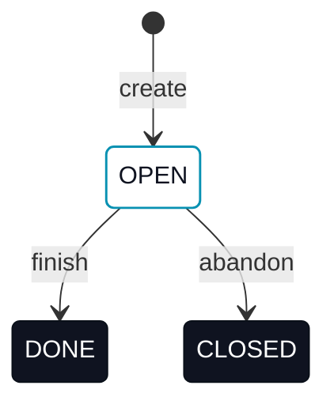

# AGENTS.md

Module-specific guidance for `erun-docs`. Follow the repository root `AGENTS.md` first, then apply this file for work in this subtree.

## Module role

- `erun-docs` is the public product documentation site for ERun, served at `https://docs.erunpaas.com`.
- It is a Docusaurus 3.x app: TypeScript config, Yarn workspaces-style layout, local search plugin (no Algolia), Mermaid for diagrams.
- This module owns the documentation **content** and the Docusaurus build configuration. It does not contain application behavior.
- The deploy contract — image and helm chart — lives outside this module:
  - Image: `erun-devops/docker/erun-docs/` (its Docusaurus builder stage runs `yarn install` and `yarn build`, so a broken site fails `erun build`)
  - Helm chart: `erun-devops/k8s/erun-docs/`

## Hosting contract

- The static site is published to Cloudflare Pages via `wrangler pages deploy` running inside a Kubernetes Job (the chart above).
- The Job is wired as a Helm `post-install,post-upgrade` hook with `helm.sh/hook-delete-policy: before-hook-creation,hook-succeeded`. Each `erun deploy` runs a fresh Job; success cleans it up.
- Cloudflare Pages handles CDN, TLS, custom domain (`docs.erunpaas.com`), and per-deploy preview URLs. There is no in-cluster Service, Ingress, or long-running pod.

## Provisioning

Docs publishing is self-provisioning from a **Cloudflare cloud alias** whose token can manage Pages. Attach the alias to the env (`erun cloud set <tenant>/<env> --alias <name>@cloudflare`) with a token that has **`Pages:Edit`** (alongside the `Zone:Read + DNS:Edit` the edge already needs); `erun deploy` and the deploy Job wire the rest:

1. **Publish credentials — automatic.** `erun deploy` mints the `<release>-cloudflare` Secret from the alias (holding `CLOUDFLARE_API_TOKEN`) and threads the account id as the `cloudContext.cloudflare.accountId` value. The chart defaults `docs.credentialsSecretName` to that Secret and reads the account id from that value, so **no hand-created `cf-creds` is needed**. Override the secret name via `docs.credentialsSecretName` and the account id via `docs.accountId` only for a setup with no Cloudflare alias.
2. **Pages project — automatic.** The deploy Job creates the Direct-Upload Pages project named `docs.project` (default `erun-docs`) on first run if it is missing (`wrangler pages project create`, tolerating "already exists"; a token without `Pages:Edit` fails here with a clear error), then uploads.

Still external / manual:

3. **Custom domain** `docs.erunpaas.com` attached to the Pages project. **(Planned.)** The DNS record is not cut over yet, so `https://docs.erunpaas.com` is not live; until it is, the site is reachable only at its Cloudflare Pages preview URL. Treat the custom-domain URL as aspirational wherever it appears above.
4. **DNS** for `erunpaas.com` proxied through Cloudflare so the custom domain serves TLS automatically.

The Job refuses to run if `CLOUDFLARE_API_TOKEN`, `CLOUDFLARE_ACCOUNT_ID`, `CF_PAGES_PROJECT`, or `CF_PAGES_BRANCH` are missing — which now only happens when no Cloudflare alias is attached to the env.

## Local development

```bash
cd erun-docs
yarn install
yarn start          # http://localhost:3000
yarn build          # produces ./build/
yarn typecheck      # tsc against docusaurus.config.ts and sidebars.ts
```

Requires Node 20+. The repo pins `yarn@1.22.22` via `packageManager`.

**Static assets do not reliably hot-reload through `yarn start`.** Webpack-dev-server caches files under `static/` (most commonly the SVGs in `static/img/`) in memory at startup. When you edit an SVG, the prose around it hot-reloads (markdown is watched) but the SVG keeps its pre-edit version, and the browser also tends to cache static-asset responses aggressively. A full restart picks it up:

1. `Ctrl+C` the `yarn start` process.
2. Optionally `rm -rf .docusaurus` if the cache feels stuck.
3. Re-run `yarn start`.
4. Hard-refresh the browser (Cmd+Shift+R / Ctrl+Shift+R) or open the page in a private window.

If "the SVG looks wrong" persists after a restart, run `xmllint --noout static/img/<file>.svg` to confirm the file is XML-valid — a malformed SVG (see [Diagram conventions](#diagram-conventions)) renders as the broken-image icon plus alt text and won't ever look right no matter how many times you reload.

## Content rules

- **Voice.** User-facing voice (someone using the product). Engineering-internal rules belong in the other `AGENTS.md` files, not in published docs.
- **Headings.** Sentence case (`Tenants and environments`, not `Tenants And Environments`).
- **Examples.** Every CLI snippet must be a command that actually works against the current ERun release. Out-of-date commands are worse than no commands — prefer a TODO marker if a command is unstable.
- **Links.** Use Docusaurus relative routes (`/concepts/tenants-and-environments`), not raw file paths.
- **Diagrams.** Two formats; pick the right one for the job. See [Diagram conventions](#diagram-conventions) below for the full vocabulary.
  - **Hand-coded SVG** (`static/img/*.svg`) for concept / hero diagrams that need pixel-perfect uniformity. Wrapped in a `<figure className="erun-hero-figure">`.
  - **Mermaid** for state diagrams, lifecycles, and any auto-laid-out flow where some box-size variance is acceptable. Branded globally via `themeVariables` in `docusaurus.config.ts`; per-diagram styling via `classDef` (see template below).
- **Frontmatter.** Every doc page declares at least `title:`. Use `slug:` only when the file path doesn't match the desired URL.
- **Chapter structure.** A section can't be a diagram alone. The minimal shape is `## heading` → **one lead sentence** framing what's about to be shown → `<figure>` with the diagram → optional **closer** sentence drawing out the implication. A chapter that opens with a heading and jumps straight into a figure reads hollow: the reader doesn't know what they're looking at until they've decoded it. Lead the diagram, don't dump it. If you find yourself wanting the diagram to do all the work, the prose framing is the missing piece, not the diagram.
- **Concrete > abstract.** When introducing a structure (a Story format, an event shape, an agent-collaboration model), show a concrete example with real-looking values, not just an abstract template. The reader matches against examples; abstract field-name lists make them guess.

## When to convert prose to a diagram

Convert when:

- The prose has **three or more parallel items being compared** — bullet lists of side-by-side claims usually read better as cards (e.g. the four-pillar "What makes ERun different" diagram).
- The prose describes a **sequence of steps** — `step 1 → step 2 → ...` becomes a horizontal flow with arrows (the 6-step "Build a small app" overview).
- The prose describes a **hierarchy** — outer-contains-inner reads naturally as nested cards (Epic → Story → Task; Cluster → Namespace → Pod).
- The prose describes **two paths converging at the same outcome** — a Y-merge with both paths labelled (the macOS / Windows getting-started split).
- The prose describes **layers** where each hides the one below — a vertical abstraction stack (Operator → Agent → MCP → Kubernetes).
- The reader needs to hold ≥ ~150 words of structure in their head before the next paragraph makes sense.

Don't convert when:

- The content is a single command or one short fact — a diagram is overkill.
- The content is free-form narrative where the sequence isn't the point.
- The content is a code block — code is already structured.
- The diagram would be ≤ 3 boxes with no arrows — a sentence works at least as well.

## Audience: Operator vs Agent

The docs serve two audiences. Every page belongs to one of them. The split is binding — it determines what content the page is allowed to contain.

### The split

| Audience | What the docs deliver | What they don't see (by design) |
|---|---|---|
| **Operator** — the human running ERun | Conceptual model, hands-on walkthroughs, day-to-day commands, troubleshooting recipes, the "what" and "why" | Field tables, JSON schemas, regex resolution rules, error-code catalogues, audit-event taxonomies, OIDC details, build-path algorithms |
| **Agent** — Claude Code / Codex / any MCP client | Everything in the previous column **plus** the spec layer: exact MCP tool schemas, every API error code, every config field's semantics, every resolution algorithm step-by-step | n/a — Agents read the lot |

The directional rule: **details that would let an Operator do something the Agent should be doing → Agent reference.** If an Operator finds themselves looking up a field's exact YAML key, that's usually a sign the Agent should be handling it via one of the [action tools](/mcp/overview#action--typed-wrappers-around-the-cli) or a [skill bundle](/concepts/skills).

### Where pages live

| Sidebar section | Audience |
|---|---|
| `intro`, `Getting started`, `CLI`, `Desktop app` | Operator |
| `Operator + Agent` (collaboration concepts) | Operator |
| `Operator reference` (cheatsheet, FAQ, troubleshooting) | Operator |
| **`Agent reference`** — Concepts sub-section, MCP, Agent patterns, erun API, Platform spec, Configuration spec | Agent (Operators can dip in when curious, but it's not where they navigate) |
| `Admin` | Cluster admin (separate, infrastructure-side) |

When you add a page, ask which sidebar section it belongs in *first* — the answer determines the content rules below.

### Operator-page rules

- One value-prop sentence at the top, then a diagram (where useful), then the workflow.
- Show commands, not options. `erun open` is enough; `erun open --vscode --no-shell --version 1.4.2` belongs in CLI reference.
- Don't enumerate fields. Replace `EnvConfig.sshd.workspacesync.enabled: true` with "enable workspace sync in the desktop's env settings".
- Don't show JSON-RPC envelopes, error tables, or HTTP status codes. Link to the Agent reference for those.
- Use the [canonical terminology](#canonical-terminology) — Operators read other Operator pages and the words have to match.
- End with **Where next** linking to: the next hands-on page, one concept page (if relevant), and at most one Operator-reference page.

### Agent-reference rules

- Spec the full input + output schema of every tool, endpoint, or resolution algorithm. No "see source code" pointers.
- Every state machine has a labelled transition; every error has a status code + machine-readable `code`; every algorithm has numbered steps.
- Cross-link to the Operator-facing companion page at the top ("for the Operator view, see X") so a curious Operator can navigate back.
- When two Agent-reference pages cover related material, one is the source of truth and the other links to it — never duplicate.

### Companion pages

A non-trivial concept gets a *pair* of pages: an Operator-facing summary and an Agent-reference spec. Examples already in the docs:

| Concept | Operator page | Agent-reference spec |
|---|---|---|
| The audit trail | `collaboration/operator-in-the-loop` (purpose + retention summary) | `agent-reference/audit-log` (event shape, security events) |
| OIDC sign-in | `collaboration/overview` (one-paragraph summary + diagram) | `agent-reference/api-protocol` (tenant-issuer schema, errors, rate limits) |
| Idle stop | `concepts/cloud-contexts` (one paragraph) | `agent-reference/idle-policy` (predicate, working-hours semantics) |
| Conventions | `concepts/conventions` (the layout + diagrams) | `agent-reference/conventions-spec` (resolution algorithms) |

The Operator page is short and links out; the Agent reference is comprehensive. Don't merge them.

## Canonical terminology

Pick the right term once and use it consistently. Drift between pages breaks search and confuses both audiences. The glossary at `concepts/glossary` is the source of truth — every doc-writing pass should grep for the don't-say list before committing.

| Concept | Canonical | Don't say |
|---|---|---|
| Human user | **Operator** (capitalised when used as a role; lowercase OK in flowing prose) | user, human, developer |
| AI assistant | **Agent** (capitalised) | AI assistant, bot, copilot, the AI |
| Isolated workspace | **environment** (env for short) | sandbox |
| K8s primitive backing an env | **namespace** (only when discussing K8s internals) | sandbox, env (for the K8s side) |
| Development-mode env | **agent env** (compound, lowercase) | dev env, snapshot env |
| Serving-mode env | **runtime env** (compound, lowercase) | non-local env, prod env, snapshot=false env |
| Cluster ERun manages | **cluster** (or **cloud context** for managed clusters) | "ERun cluster" |

Compound terms (`agent env`, `runtime env`, `agent-driven`, `multi-arch`) stay lowercase even when the constituent role would be capitalised standalone.

JSON literal values (e.g., `"kind": "operator"` in audit events) keep their casing as documented in the spec; that's data, not prose.

**When you do a terminology sweep, grep `static/img/*.svg` as well as `docs/`.** SVG text content (the `<title>` element, every `<text>` element, every `alt="..."` attribute in the markdown that references an SVG) gets missed by `grep -rn '<bad-term>' docs/` and then ships invisibly — the markdown reads correct but the rendered diagram still uses the old vocabulary. Same goes for the `<!-- comments -->` inside SVGs: comments aren't user-visible but they're a fast indicator of how stale the file is, so include them in the sweep. Always pair `grep -rn '<bad-term>' docs/` with `grep -rn '<bad-term>' static/img/`.

## Spec discipline

The docs are the spec. Behaviour that isn't documented isn't part of the contract.

### Treat vagueness as a bug

When you find a page saying "ERun handles X" without specifying *how*, write the spec. Examples that have come up:

- "MCP tools" → 4 categories, 18+ tools each with schemas.
- "audit trail" → 3 layers, event shape, retention windows, security-event catalogue.
- "fingerprint cache" → 4-step algorithm, registry-pull + local-tag rules.
- "OIDC sign-in" → tenant-issuer schema, error codes, service-account flow.
- "dry-run redacts secrets" → exact regex list, what's redacted, what's not, when redaction happens.

If you can't spec the behaviour confidently, mark it `(Planned.)` and link to the issue.

### Error tables on every action

Every CLI command, every MCP action tool, every API endpoint has an **Error behaviour** section listing:

- The failure mode in user terms.
- What happens (exit code, HTTP status, partial-state behaviour).
- How to recover.

Vague "errors if not in a git repo" is not enough. Write "aborts with `not in a git repository`; exit code 1; suggests `git init` or `--project-root`".

### Single source of truth

Each piece of detail lives in exactly one page. Other pages reference it.

- Fingerprint cache: in `agent-reference/conventions-spec`. Referenced from `release-flow`, `cli/build`.
- Idle-stop predicate: in `agent-reference/idle-policy`. Referenced from `cloud-contexts`, `concepts/cloud-contexts`.
- OIDC error codes: in `agent-reference/api-protocol`. Referenced from `collaboration/overview`.
- Step timing (the `build`/`release`/`push`/`deploy` table + JSON record): in `reference/config-locations#step-timing`. Referenced from `concepts/observability`.

When you find duplication, pick the canonical home and turn the others into pointers.

## Adding a page

1. Drop a markdown file under `docs/<section>/<page>.md` with a `title:` frontmatter.
2. Add the page id to `sidebars.ts` under the right category (file id is the path relative to `docs/` without `.md`). Pick the section based on **[audience](#audience-operator-vs-agent)**, not topic.
3. Run `yarn start` and verify the page renders + the navbar entry shows up.
4. Run `yarn build` to catch broken links — `onBrokenLinks: 'throw'` will fail the build on any.
5. If the page introduces or specs a behaviour, check the [Spec discipline](#spec-discipline) checklist: schemas defined? errors enumerated? canonical terminology? single source of truth?

## Page maintenance

- **Sidebar order: foundational pages first.** A reader landing in a section should hit the intro / model-explaining page first, not the deepest reference. When a page becomes the foundational one for its section (often after a merge), move it to position 0 of that section's `items[]`.
- **Merge overlapping pages instead of cross-linking forever.** When two pages cover the same ground from different angles (e.g. "Operator maturity" and "Workflow" both explaining Operator–Agent collaboration), prefer one merged page. Keep the URL of whichever page has more inbound links / is more commonly referenced; delete the other file; grep inbound links and repoint them to anchors on the merged page.
- **Explicit anchor IDs for non-trivial headings.** Docusaurus auto-slugs headings; the algorithm normalises em-dashes, parentheses, and trailing punctuation in ways that aren't always intuitive. When the implied slug is fragile, add an explicit anchor: `### Skills — opinionated, template-driven {#built-in-skills}`. Inbound links then reference `#built-in-skills` instead of guessing.
- **Audit inbound anchors before moving content.** Moving a section to another page breaks anchors silently — Docusaurus warns about broken anchors at build time but only at warning severity, easy to miss. Grep before moving: `grep -rn '#old-anchor' docs/`. Re-grep after the move to confirm nothing dangles. Same applies when you slim an Operator page and the detail moves to an Agent-reference page.
- **Don't create new files unless the user asks.** Root `AGENTS.md` rule. Add content to an existing page (or this `AGENTS.md`) instead.

## Versioning

- Versioning is **off** initially. Turn it on when ERun ships its first GA release.
- When turned on, use Docusaurus's `docusaurus docs:version <X.Y>` command to snapshot the current `docs/` into `versioned_docs/version-X.Y/`.

## Diagram conventions

All diagrams use one shared visual vocabulary. Two shapes, two colors. Same vocabulary across Mermaid and SVG so the site looks like one product.

### Visual vocabulary

| Element | Role | Style |
|---|---|---|
| **Endpoint pill** | A boundary node: an external actor, a source, a sink, a terminal state. (Operator, Production, Idea, your machine, git, registry, Start, Done, Rejected, …) | Charcoal fill `#0f1320` (gradient to `#1a2030`), white text, `rx: 14`. No stroke or very dark stroke. |
| **Step / workload box** | An active state or service inside the flow. (Sandbox, Runtime pod, Review, IN_PROGRESS, Backend, …) | White fill, charcoal text (`currentColor` in SVG so it adapts to theme), cyan stroke `#0891b2` at 1.5px, `rx: 14`. |
| **Namespace / cluster card** | A grouping or boundary that contains other nodes. (k8s namespace boxes in env-types.) | Very light grey fill `#fbfcfd`, light grey stroke `#cbd5e0`, `rx: 18`. |
| **Solid arrow** | The main flow / work moving forward. | Cyan stroke `#0891b2` at 1.5px, arrowhead filled cyan. |
| **Dashed arrow** | An operator stepping in, a callback, an out-of-band signal. | Brighter cyan `#22d3ee` at 1.5px, `stroke-dasharray: 5 5`, arrowhead filled `#22d3ee`. |
| **Edge label** | A label sitting on an arrow line. | Background pill with `fill="var(--ifm-background-color, #ffffff)"` so the line is punched through. Text in `#0891b2` (cyan), font-size 11–12, font-weight 500. |

### When to use SVG vs Mermaid

| Pick SVG when… | Pick Mermaid when… |
|---|---|
| The diagram is concept-level / "hero" and box uniformity matters visually. | The diagram is a state machine or lifecycle that benefits from auto-layout. |
| You need precise dimensions (e.g. three sandboxes that must look identical). | Box-size variance per content is acceptable. |
| The number of elements is small (≤ ~10 shapes). | The graph is complex enough that hand-placing would be tedious. |
| Polish > editability. | Editability > polish. |

If unsure, prefer Mermaid first — and only escalate to SVG if the result looks visibly off.

### SVG template

Use `<symbol>` + `<use>` to keep shapes reusable. A new diagram should copy this skeleton and only edit positions:

```xml
<svg viewBox="0 0 W H" xmlns="http://www.w3.org/2000/svg" role="img" aria-labelledby="diagTitle"
     font-family="-apple-system, BlinkMacSystemFont, 'Inter', 'Segoe UI', Roboto, sans-serif">
  <title id="diagTitle">What the diagram conveys (used by screen readers).</title>

  <defs>
    <linearGradient id="charcoal" x1="0" y1="0" x2="0" y2="1">
      <stop offset="0%" stop-color="#1a2030"/>
      <stop offset="100%" stop-color="#0f1320"/>
    </linearGradient>

    <marker id="arrowSolid" markerWidth="10" markerHeight="10" refX="9" refY="3" orient="auto" markerUnits="strokeWidth">
      <path d="M0,0 L9,3 L0,6 Z" fill="#0891b2"/>
    </marker>
    <marker id="arrowDashed" markerWidth="10" markerHeight="10" refX="9" refY="3" orient="auto" markerUnits="strokeWidth">
      <path d="M0,0 L9,3 L0,6 Z" fill="#22d3ee"/>
    </marker>

    <!-- Reusable shapes. Edit width/height here once to resize every instance.
         overflow="visible" is REQUIRED on any symbol whose inner shape has a
         stroke — without it the symbol's viewBox clips the outer half of the
         stroke, which makes rounded corners visibly tighter than the same
         shape inlined as a bare <rect>. See "Stroked shapes" note below. -->
    <symbol id="endpointBox" viewBox="0 0 200 50">
      <rect width="200" height="50" rx="14" fill="url(#charcoal)"/>
    </symbol>
    <symbol id="stepBox" viewBox="0 0 240 100" overflow="visible">
      <rect width="240" height="100" rx="14" fill="none" stroke="#0891b2" stroke-width="1.5"/>
    </symbol>
    <symbol id="cardBox" viewBox="0 0 320 460" overflow="visible">
      <rect width="320" height="460" rx="18" fill="#fbfcfd" stroke="#cbd5e0" stroke-width="1"/>
    </symbol>
  </defs>

  <!-- Per-instance positioning. Every <use> MUST include width + height matching
       the symbol's viewBox, or the symbol renders at 100% of the SVG canvas. -->
  <use href="#endpointBox" x="100" y="120" width="200" height="50"/>
  <text x="200" y="152" text-anchor="middle" fill="#ffffff" font-size="14" font-weight="600">your machine</text>

  <use href="#stepBox" x="80" y="310" width="240" height="100"/>
  <text x="200" y="352" text-anchor="middle" fill="currentColor" font-size="15" font-weight="600">runtime pod</text>
  <text x="200" y="378" text-anchor="middle" fill="currentColor" font-size="13" opacity="0.85">+ worktree</text>

  <line x1="200" y1="180" x2="200" y2="305" stroke="#0891b2" stroke-width="1.5" marker-end="url(#arrowSolid)"/>
  <g>
    <rect x="166" y="222" width="68" height="22" rx="11" fill="var(--ifm-background-color, #ffffff)"/>
    <text x="200" y="237" text-anchor="middle" fill="#0891b2" font-size="12" font-weight="500">hostPath</text>
  </g>
</svg>
```

Conventions:

- **Place SVGs under `static/img/`** with a filename matching the topic (e.g. `env-types.svg`, `hero-flow.svg`).
- **Reference from markdown** via a figure wrapper so the site's CSS handles centering and width:
  ```mdx
  <figure className="erun-hero-figure">
    
  </figure>
  ```
- **Alt text matters.** Describe the relationships, not the geometry. Screen readers and search index both read it.
- **Text adapts to theme** by using `fill="currentColor"` on body labels so dark mode flips them. Charcoal endpoint text stays `#ffffff` (it's on a dark fill regardless of theme).
- **Edge labels punch through arrows** by sitting in a background-colored pill: `<rect fill="var(--ifm-background-color, #ffffff)">` then the text on top.
- **No `width`/`height` attribute on the root `<svg>`** — use only `viewBox` so the responsive `.erun-hero-figure img { width: 100%; height: auto; }` rule can size it.
- **Only XML predefined entities — no HTML entities.** SVGs loaded via `` are parsed strictly as XML, which knows just five entities: `&amp;`, `&lt;`, `&gt;`, `&quot;`, `&apos;`. Common HTML entities like `&middot;`, `&mdash;`, `&ndash;`, `&hellip;`, `&nbsp;` are *undefined* in XML and cause the entire SVG to fail parsing — the browser shows a broken-image icon and falls back to alt text. For typographic characters, paste the literal Unicode glyph (`·`, `—`, `–`, `…`, ` `) directly into the file (it's UTF-8) or use a numeric reference (`&#xB7;`, `&#x2014;`). Same applies to any inline SVG generated by tooling that isn't told to emit XML-safe entities.
- **A bare `&` in text content is also invalid XML.** Distinct from the HTML-entity gotcha above: writing `INSPECTION & AUTOMATION` (literal `&`) makes the file unparseable just as surely as `INSPECTION &middot; AUTOMATION`. Always escape to `&amp;` (`INSPECTION &amp; AUTOMATION`). The parser stops at the first bare `&`; everything below renders as broken.
- **Double hyphens are not allowed inside XML comments.** `<!-- documents the --version flag -->` is invalid because XML reserves `--` for the comment terminator. Common offender: documenting a CLI flag inside an SVG comment. Reword the comment to remove the `--`, or split into two comments around the offending phrase.
- **Run `xmllint --noout static/img/<file>.svg` before committing.** It catches every class of issue above in one command. Docusaurus's build pipeline doesn't validate static-asset XML — a malformed SVG happily ships and only manifests as a broken-image icon in the browser. Treat `xmllint` as a pre-commit check for any SVG edit.
- **Stroked shapes inside `<symbol>` need `overflow="visible"`.** A `<symbol>` clips its contents to its `viewBox` by default. If the inner rect has a `stroke`, the stroke extends `strokeWidth/2` outside the rect bounds — and that half gets clipped at every edge. The corner radius is unaffected mathematically, but visually the corner looks *tighter* because only the inner half of the stroke arc remains. The fix is one of:
  1. Add `overflow="visible"` to the symbol (shown above) — keeps the symbol reusable.
  2. Expand the symbol's `viewBox` to leave room for the stroke (e.g. `viewBox="-1 -1 242 112"` for a `1.5` stroke on a `240×110` rect).
  3. Inline the `<rect>` directly without a symbol (what `hero-flow.svg` does) — the cleanest option for a shape used only once or twice.
  If a stroked shape in one diagram looks subtly different from the same shape in another, this is almost always the cause.

### Common layout patterns

Four layouts recur across the existing diagrams; reach for one of these before inventing a new shape:

| Pattern | When to use | Example in the docs |
|---|---|---|
| **Vertical abstraction stack** | Each layer hides the one below it. Top-down dependency chain. | `abstraction-stack.svg` (Operator → Agent → MCP / SSH → runtime pod → K8s namespaces). |
| **Y-merge / convergence** | Two starting paths joining at a single outcome. Each path is a short chain of steps; both end at the same "ready" or "done" state via a horizontal line that funnels into a single arrow. | `os-paths.svg` (macOS path + Windows path → "Ready to work"). |
| **Parallel channels** | One actor reaching one destination via more than one labelled channel. Two arrows leaving the same origin, both arriving at the same target. | `abstraction-stack.svg`'s `ssh:` + `mcp:` arrows from the Agent into the runtime pod. |
| **Nested containers** | A hierarchy where each level groups the level inside it. Outer namespace-style card, inner cyan-stroked step boxes, innermost text-list items. | `epic-story-tasks.svg` (Epic → Stories → Tasks); `inside-environment.svg` (namespace → runtime pod + services). |

If you find yourself drawing one of these and it doesn't match the existing example's vocabulary, look at the existing file before improvising — convergence labels, arrow stroke widths, header pill shapes are all set and should not drift between diagrams.

### Mermaid template

For state/flow diagrams, define `endpoint` / `step` / `namespace` classes once and use them via `:::endpoint` / `:::step` / `class X namespace`. Same names everywhere — this is the shared vocabulary.



Node shapes:

- Rounded rectangle `(...)` for both endpoints and steps — they're distinguished by `classDef`, not by shape.
- Stadium `([...])` and ellipse `((...))` look distorted on short labels — avoid.

For state diagrams, use the same `classDef`s but apply via `class STATE_NAME endpoint` syntax:



Global theme variables (font, line color, edge label background, spacing) are set in `docusaurus.config.ts` under `themeConfig.mermaid.options`. Per-diagram `classDef` lines override only what's local.

### Self-check before shipping a diagram

**Verify the diagram renders correctly before presenting it for review.** Do not declare a diagram done after only writing it. Run through this checklist every time:

1. **`yarn build` clean** — broken markdown links and parse errors surface here. A red build means the diagram is wrong, period.
2. **SVG-specific checks:**
   - Every `<use>` referencing a `<symbol>` has explicit `width` and `height` matching the symbol's `viewBox`. Without them, `<use>` renders the symbol at 100% of the SVG canvas — produces a giant colored bar covering the diagram. This is the single most common SVG bug. Grep for `<use ` in the file and confirm each line has both `width=` and `height=`.
   - Every `<symbol>` whose inner shape has a `stroke` declares `overflow="visible"` (or its `viewBox` is expanded to leave stroke room). Otherwise the stroke is clipped at the viewBox edge and the rounded corners look tighter than the same shape inlined — a subtle drift that breaks visual parity between diagrams.
   - No HTML entities (`&middot;`, `&mdash;`, `&ndash;`, `&hellip;`, `&nbsp;`, …). They are undefined in XML and break the whole SVG when it's loaded via ``. Grep for `&[a-z]\+;` and replace anything beyond the five XML predefined entities with literal Unicode glyphs.
   - Every shape and text element fits inside the `viewBox`. Stray elements (e.g. y > viewBox height) silently disappear at small zoom levels and only show up when the viewport is large.
   - Arrow endpoints land at the edge of their target shape, not inside it (otherwise the arrowhead is hidden by the shape).
   - Edge labels with background pills are positioned so the pill fully covers the arrow line passing under it.
3. **Mermaid-specific checks:**
   - All `classDef` declarations are at the bottom (mermaid sometimes drops them if interleaved).
   - Every node referenced with `:::className` or via `class node className` has the matching `classDef` defined.
   - Sub-graphs in `flowchart LR` lay out in declaration order — if not, add invisible `~~~` links between them.
4. **Render the page locally** at `yarn start` (`http://localhost:3000`) and *look at the diagram in the browser*. Compare against the visual vocabulary table above:
   - Are endpoint pills charcoal? Are step boxes cyan-stroked? Are corners rounded?
   - Are the three subgraphs (or whatever the layout is) sized consistently and aligned?
   - Is the arrow flow clear? Are labels readable, not overlapping?
5. **Spot-check at a few viewport widths.** The figure container has `max-width: 920px`; the diagram has to look OK at that width and also at smaller (mobile) widths. Resize the browser to ~640px and check the diagram doesn't get clipped or stretched awkwardly.
6. **Only after all five pass** is the diagram ready to show. If something looks off, fix it before presenting — humans aren't the QA, the diagram should be correct on first viewing.

## What not to do

- Do not import images of Architecture or Privacy-sensitive infra screens. Stick to abstract diagrams.
- Do not embed API tokens or environment-specific URLs in example commands.
- Do not add a separate README under `erun-docs/` — the site's `intro.md` and this `AGENTS.md` together cover the audiences (users and contributors).
