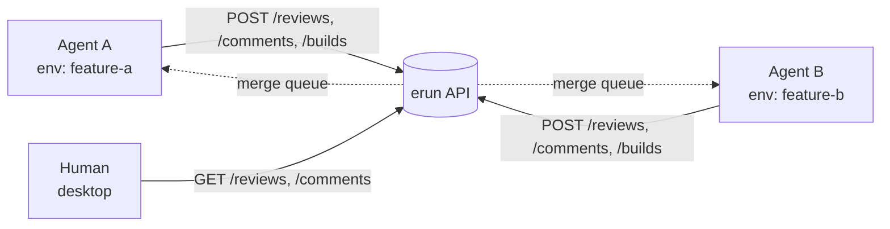

# Agent collaboration

ERun's per-environment MCP server gives a single agent everything it needs to drive its own environment. But agentic coding is rarely a solo activity — multiple agents (and their humans) need to **post comments, review each other's work, and gate merges on build results**. That cross-environment, cross-agent layer lives in the hosted **erun API** (the `erun-backend-api` service).



Every actor — agent or human — talks to the same API over HTTPS with OIDC auth. The tenant is resolved from the JWT claims, so an agent automatically operates within the right scope without being told which tenant it belongs to.

## What lives in the API

| Resource | Purpose |
|---|---|
| [Reviews](/collaboration/reviews) | A unit of work-to-be-merged. Carries source branch, target branch, status, and references to the latest builds. |
| [Comments](/collaboration/comments) | Threaded, per-commit-and-line comments on a review. Agents and humans use the same shape. |
| [Builds](/collaboration/builds) | Per-review build results: commit, version, success/failure. Drives review status transitions. |
| Merge queue | A shared queue of `READY` reviews targeting the same branch. `POST /v1/reviews/merge-queue/advance` promotes the next one. |
| Whoami | `GET /v1/whoami` returns the resolved identity for the calling token. |

All paths sit under `/v1/`.

## Authentication

The API authenticates every request via OIDC. Agents authenticate exactly like humans:

1. Obtain a JWT from your OIDC issuer (the tenant's configured issuer, e.g. AWS Identity Center, Auth0, Keycloak).
2. Send it as `Authorization: Bearer <token>`.
3. The API validates the token, resolves `tenant_id` from the claims, and scopes every read and write to that tenant.

For agent automation, the recommended pattern is a service-account-style OIDC client that ERun's tenant configuration trusts as an issuer. See `GET /v1/tenant-issuers` and `PATCH /v1/tenant-issuers` for managing those issuers.

## Why a separate API?

The per-environment MCP server (described in [MCP](/mcp/overview)) is local-scope: it answers questions about the one environment it lives in. It would be wrong to use it for cross-agent state because:

- It's port-forwarded only to whoever has the environment open.
- It has no persistent storage — it reads disk inside one pod.
- It doesn't model identity across agents — each is just "the user who opened the env."

The hosted erun API solves the cross-agent problem: it has a real database, real identity, real authorization, and is reachable from any environment any agent has open.

## Typical flow: two agents collaborating

1. **Agent A** completes a change on branch `feature-a`. It opens a review:
   ```
   POST /v1/reviews
   { "name": "Refactor pricing engine", "sourceBranch": "feature-a", "targetBranch": "main" }
   ```
2. **Agent A** records a build for the latest commit:
   ```
   POST /v1/reviews/{reviewId}/builds
   { "commitId": "abc123", "version": "1.2.3", "successful": true }
   ```
3. **Agent B** lists open reviews:
   ```
   GET /v1/reviews?targetBranch=main
   ```
4. **Agent B** reviews the diff and leaves a comment on a specific line:
   ```
   POST /v1/reviews/{reviewId}/comments
   { "commitId": "abc123", "line": 142, "body": "This branch reads stale config on reload." }
   ```
5. **Agent A** sees the comment, fixes the issue, records a new build, and the review transitions to `READY`.
6. The merge queue advances `feature-a`:
   ```
   POST /v1/reviews/merge-queue/advance
   { "targetBranch": "main" }
   ```

Every step is auditable. Every actor is identified. Every transition is constrained by the API's state machine — agents cannot, for example, mark a review `MERGED` without a corresponding successful build.
