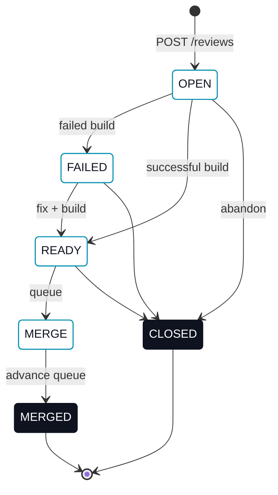

# Reviews

A **review** is the unit of work-to-be-merged. It binds a source branch to a target branch and tracks the state of that pairing through to merge.

## Resource shape

```jsonc
{
  "reviewId": "rev_01H...",
  "tenantId": "tnt_01H...",
  "authorUserId": "usr_01H...",           // the caller that created the review; server-derived, never client-set
  "name": "Refactor pricing engine",
  "targetBranch": "main",
  "sourceBranch": "feature-a",
  "status": "OPEN",                       // OPEN | CLOSED | FAILED | READY | MERGE | MERGED
  "lastFailedBuildId": "bld_...",
  "lastReadyBuildId": "bld_...",
  "lastMergedBuildId": "bld_...",
  "createdAt": "2026-05-24T10:42:00Z",
  "updatedAt": "2026-05-24T11:13:00Z"
}
```

`authorUserId` is always the authenticated caller that created the review. A `POST /v1/reviews` body that includes `authorUserId` has it ignored — a client cannot assert authorship for someone else.

## Endpoints

| Method | Path | Description |
|---|---|---|
| `GET` | `/v1/reviews` | List reviews. Optional filters, all composable: `?targetBranch=<name>`, `?sourceBranch=<name>`, `?status=<OPEN\|CLOSED\|FAILED\|READY\|MERGE\|MERGED>`, `?authorUserId=<id>`, `?reviewerUserId=<id>`. |
| `POST` | `/v1/reviews` | Create a review. Body: `name`, `sourceBranch`, `targetBranch`. Refused with `409 Conflict` if another non-`MERGED`/`CLOSED` review already proposes the same `sourceBranch` onto the same `targetBranch`. |
| `GET` | `/v1/reviews/{reviewId}` | Fetch one review. |
| `PATCH` | `/v1/reviews/{reviewId}/status` | Update review status. Body: `status`, `buildId`. |
| `GET` | `/v1/reviews/merge-queue` | List reviews queued to merge (status `MERGE`). Optional `?targetBranch=<name>`. |
| `POST` | `/v1/reviews/merge-queue/advance` | Promote the next queued review to `MERGED`. Body: `targetBranch`. |
| `GET` | `/v1/reviews/{reviewId}/reviewers` | List the review's reviewers. |
| `POST` | `/v1/reviews/{reviewId}/reviewers` | Add a reviewer. Body: `userId`. |
| `DELETE` | `/v1/reviews/{reviewId}/reviewers/{userId}` | Remove a reviewer. `204 No Content` on success. |

## Author, reviewers, and discovery

Every review has exactly one author and any number of reviewers:

- **Author.** Set once, at creation, to the authenticated caller. It never changes and cannot be reassigned.
- **Reviewers.** Zero or more users explicitly assigned to a review. Assigning a reviewer does not gate any status transition today — `PATCH .../status` still works the same regardless of who (if anyone) is assigned. A reviewer's tenant must match the review's tenant; a cross-tenant `userId` is refused.

The reviewer resource:

```jsonc
{
  "tenantId": "tnt_01H...",
  "reviewId": "rev_01H...",
  "userId": "usr_01H...",
  "createdAt": "2026-05-24T10:42:00Z",
  "updatedAt": "2026-05-24T11:13:00Z"
}
```

The `authorUserId` and `reviewerUserId` list filters make two questions answerable directly, without client-side filtering: "my reviews" is `GET /v1/reviews?authorUserId=<me>`, and "reviews waiting on me" is `GET /v1/reviews?reviewerUserId=<me>`. Both compose with `status`, `targetBranch`, and `sourceBranch`.

## One live review per branch pair

At most one non-`MERGED`, non-`CLOSED` review may propose a given `sourceBranch` onto a given `targetBranch` at a time. `POST /v1/reviews` for a branch pair that already has a live review fails with `409 Conflict`. Once that review reaches `MERGED` or `CLOSED`, the same branch pair can be proposed again — branch history is unbounded, only *live* duplicates are refused. This prevents two reviews from independently reaching the merge queue for the same change, where the second would merge a branch the target already contains.

## Status lifecycle



The status transitions are enforced server-side: an Agent cannot directly mark a review `MERGED`. The only path to `MERGED` is via the merge queue, which `POST /v1/reviews/merge-queue/advance` controls.

## Status meanings

| Status | What it means |
|---|---|
| `OPEN` | Review exists, no successful build yet, no decision either way. |
| `FAILED` | The latest build for this review failed. The corresponding build id is stored in `lastFailedBuildId`. |
| `READY` | The latest build succeeded; the review is mergeable. |
| `MERGE` | Queued for merge. Waiting for the queue to advance to its target branch. |
| `MERGED` | Successfully merged. Terminal. `lastMergedBuildId` records the merging build. |
| `CLOSED` | Closed without merge (abandoned). Terminal. |

## Merge queue

The merge queue is **shared per target branch**. All reviews with status `MERGE` and the same `targetBranch` form a single FIFO. `POST /v1/reviews/merge-queue/advance` advances the head:

```
POST /v1/reviews/merge-queue/advance
Content-Type: application/json

{ "targetBranch": "main" }
```

The server picks the head of the queue for that target branch and transitions it to `MERGED`. The response is the promoted review. If the queue is empty, the API returns an error.

This mechanism gives an organization a single, fair, audit-trail-friendly merge order even when many agents are submitting in parallel.

## Errors

All endpoints return JSON error bodies:

```jsonc
{
  "code": "INVALID_TRANSITION",
  "message": "Cannot transition review from OPEN directly to MERGED",
  "details": { "from": "OPEN", "to": "MERGED", "validTargets": ["FAILED", "READY", "CLOSED"] }
}
```

| Status | When | Example |
|---|---|---|
| `400 Bad Request` | Malformed JSON, missing required fields, type mismatches. | `POST /v1/reviews` without `sourceBranch`. |
| `401 Unauthorized` | No `Authorization` header, or token validation failed. | Bearer token expired. |
| `403 Forbidden` | Token valid; caller not allowed in this tenant. | Agent of tenant A calling on tenant B. |
| `404 Not Found` | The review or build id doesn't exist or isn't visible to the caller. | `GET /v1/reviews/rev_unknown`. |
| `409 Conflict` | Invalid state transition or queue-state mismatch; a second live review for a branch pair already proposed by a live review; a reviewer already assigned to the review. | `PATCH .../status` to `MERGED` directly; `POST /v1/reviews` proposing `feature-a` onto `main` while another live review already does. |
| `422 Unprocessable Entity` | Structurally valid but semantically invalid. | `PATCH status` to `READY` without a successful build. |
| `429 Too Many Requests` | Rate limit exceeded. | Burst of `POST /comments`. |
| `500 Internal Server Error` | Server error. Retry. | Database unavailable. |

### Machine error codes

| `code` | When | HTTP status |
|---|---|---|
| `INVALID_TRANSITION` | `PATCH /status` with a transition not allowed by the [Status lifecycle](#status-lifecycle). `details.validTargets` lists the allowed next statuses. | `409` |
| `EMPTY_QUEUE` | `POST /merge-queue/advance` against a target branch whose queue has no `MERGE`-status reviews. | `409` |
| `UNKNOWN_COMMIT` | `PATCH /status` (or `POST /builds`) referencing a `buildId` whose `commitId` doesn't exist on the review's `sourceBranch`. | `422` |
| `INVALID_BODY` | Request body missing required field or fails type validation. `details.field` names the offender. | `400` |
| `INVALID_TARGET_BRANCH` | `targetBranch` is not a valid branch name. | `400` |
| `EXPIRED_PAGE_TOKEN` | `pageToken` is stale or malformed. | `400` |

### Pagination + rate limits

List endpoints page at 100 items max; see [API protocol · Pagination](/agent-reference/api-protocol#pagination). Rate-limit buckets per token: read 600 req/min, write 60 req/min, merge-queue-advance 10 req/min. Full table: [API protocol · Rate limits](/agent-reference/api-protocol#rate-limits).
