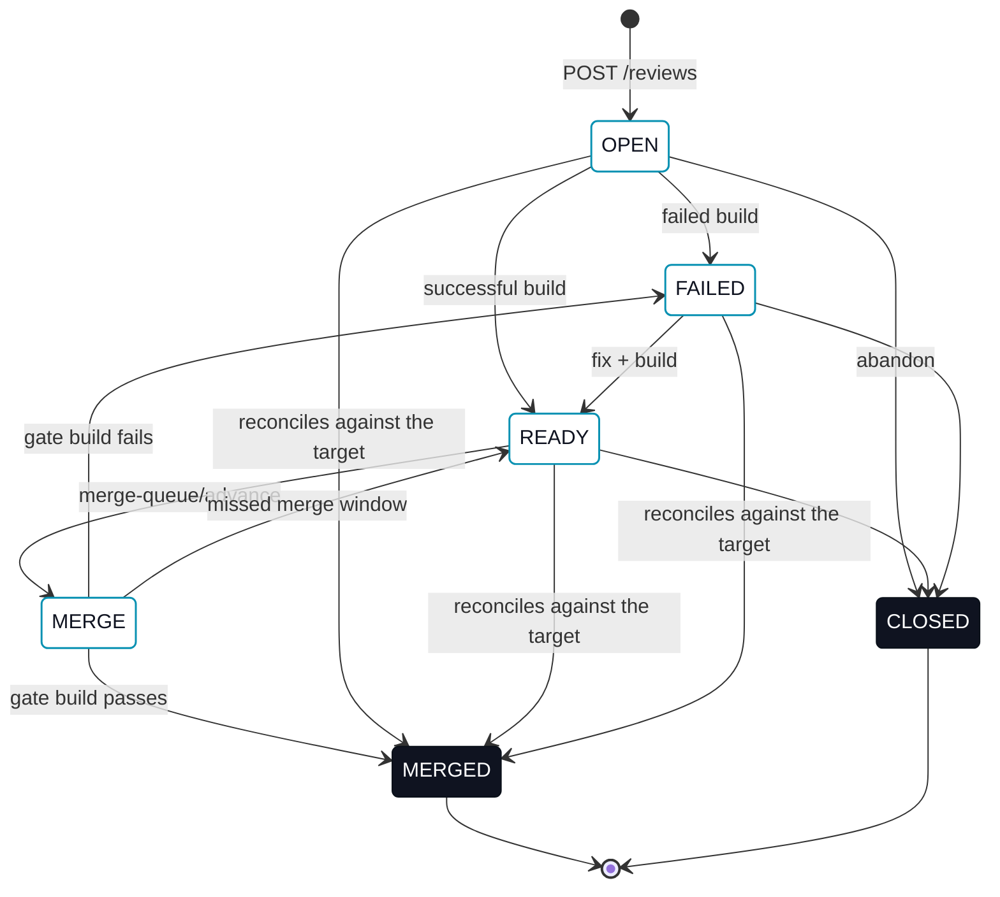

# Reviews

> For the Operator view, see [`erun review`](/cli/review).

A **review** is the unit of work-to-be-merged. It binds a source branch to a target branch and tracks the state of that pairing through to merge.

## Resource shape

```jsonc
{
  "reviewId": "rev_01H...",
  "tenantId": "tnt_01H...",
  "authorUserId": "usr_01H...",           // the caller that created the review; server-derived, never client-set
  "name": "Refactor pricing engine",
  "targetBranch": "main",
  "sourceBranch": "feature-a",
  "status": "OPEN",                       // OPEN | CLOSED | FAILED | READY | MERGE | MERGED
  "lastFailedBuildId": "bld_...",
  "lastReadyBuildId": "bld_...",
  "lastMergedBuildId": "bld_...",
  "issueRef": "2212",                     // derived on read, never stored; absent when the branch names no issue
  "issueRefSource": "INFERRED",           // always INFERRED today; present exactly when issueRef is
  "createdAt": "2026-05-24T10:42:00Z",
  "updatedAt": "2026-05-24T11:13:00Z"
}
```

`authorUserId` is always the authenticated caller that created the review. A `POST /v1/reviews` body that includes `authorUserId` has it ignored — a client cannot assert authorship for someone else.

## Endpoints

| Method | Path | Description |
|---|---|---|
| `GET` | `/v1/reviews` | List reviews. Optional filters, all composable: `?repository=<remote>`, `?targetBranch=<name>`, `?sourceBranch=<name>`, `?status=<OPEN\|CLOSED\|FAILED\|READY\|MERGE\|MERGED>`, `?authorUserId=<id>`, `?reviewerUserId=<id>`. |
| `POST` | `/v1/reviews` | Create a review. Body: `repository`, `name`, `sourceBranch`, `targetBranch`. `repository` is canonicalized (an SSH remote and its HTTPS form are one repository); an absent one is recorded as none. Refused with `400`/`INVALID_REPOSITORY` for a value that names no repository, and with `409 Conflict` if another review in the same repository already holds the name (unless it is `CLOSED`) or already proposes the same `sourceBranch` onto the same `targetBranch` while non-`MERGED`/`CLOSED`. |
| `GET` | `/v1/reviews/{reviewId}` | Fetch one review. |
| `PATCH` | `/v1/reviews/{reviewId}/status` | Update review status. Body: `status`, `buildId`, and (only for `status: "MERGED"`) `remoteUrl` — the git remote the merge was pushed to, fetched to verify the report against the real repository. `buildId` is required for a review at `MERGE` and for `READY`/`FAILED`; a `MERGED` report for a review at any other status omits it, since there is no gate build for work that landed without the queue. |
| `GET` | `/v1/reviews/merge-queue` | List reviews *waiting* to merge into a target branch (status `READY`, not yet promoted). Optional `?repository=<remote>`, `?targetBranch=<name>`; an absent `repository` lists every repository's queue, which is what a target branch alone has always meant. |
| `POST` | `/v1/reviews/merge-queue/advance` | Promote the next waiting review to `MERGE`. Body: `repository`, `targetBranch`. Refuses with `409 Conflict` when the head still has unresolved comment threads, and with `409`/`MERGE_QUEUE_AMBIGUOUS` when no repository was named and the queue holds more than one repository's reviews — see [Merge queue](#merge-queue). The promoted review is expected to build and push its own merge and report the outcome; this call does not itself produce `MERGED`. |
| `POST` | `/v1/reviews/merge-queue/override-advance` | Bypass the unresolved-thread refusal and advance anyway. Body: `repository`, `targetBranch`, `reason`. A distinct, separately-authorized route — see [Overriding the gate](#overriding-the-gate). |
| `GET` | `/v1/reviews/{reviewId}/reviewers` | List the review's reviewers. |
| `POST` | `/v1/reviews/{reviewId}/reviewers` | Add a reviewer. Body: `userId`. |
| `DELETE` | `/v1/reviews/{reviewId}/reviewers/{userId}` | Remove a reviewer. `204 No Content` on success. |

## Author, reviewers, and discovery

Every review has exactly one author and any number of reviewers:

- **Author.** Set once, at creation, to the authenticated caller. It never changes and cannot be reassigned.
- **Reviewers.** Zero or more users explicitly assigned to a review. Assigning a reviewer does not gate any status transition today — `PATCH .../status` still works the same regardless of who (if anyone) is assigned. A reviewer's tenant must match the review's tenant; a cross-tenant `userId` is refused by this API and, on the CLI and MCP clients, before the network call at all (see [`erun review reviewers`](/cli/review#review-reviewers)).

The reviewer resource:

```jsonc
{
  "tenantId": "tnt_01H...",
  "reviewId": "rev_01H...",
  "userId": "usr_01H...",
  "createdAt": "2026-05-24T10:42:00Z",
  "updatedAt": "2026-05-24T11:13:00Z"
}
```

The `repository` list filter is what separates two repositories a tenant serves that propose the same branch pair; it is not defaulted from a client's checkout, because a listing is how you find work across every repository.

The `authorUserId` and `reviewerUserId` list filters make two questions answerable directly, without client-side filtering: "my reviews" is `GET /v1/reviews?authorUserId=<me>`, and "reviews waiting on me" is `GET /v1/reviews?reviewerUserId=<me>`. Both compose with `status`, `targetBranch`, and `sourceBranch`.

## Repository identity

A review records the repository its branches belong to, as a canonicalized remote: `git@github.com:org/repo.git` and `https://github.com/org/repo` are one identity, so a review opened from an SSH checkout is the one a merge-queue environment finds over HTTPS. The platform canonicalizes whatever the caller sends rather than trusting the spelling.

Every review-scoped uniqueness rule and the merge queue are keyed by it. A tenant may serve more than one repository, and two of them will share branch names — both a `main` and a `feature/x` — so a target branch alone names a queue only in a tenant that serves exactly one repository. `MERGE_QUEUE_AMBIGUOUS` is what a promotion over a genuinely mixed queue gets instead of a guess.

A review created before the platform recorded a repository carries none, and appears only in an unfiltered listing or queue. It adopts an identity from the `remoteUrl` of the first `MERGED` report about it, which is the only moment the remote is in hand.

## Issue links

A review answers which issue its work belongs to through `issueRef`, and where that answer came from through `issueRefSource`. Neither is stored: the link is resolved every time a review is read, so a review is never bound to a stale guess.

A review carries no issue of its own yet, so the source branch is the only link there is. Branches are named `feature/<issue-number>-<description>` or `bug/<issue-number>-<description>`, and `issueRef` is the number that name carries:

```jsonc
{ "sourceBranch": "bug/2212-issue-ref-from-branch", "issueRef": "2212", "issueRefSource": "INFERRED" }
```

The derivation is **best-effort and clearly marked as such**. `issueRefSource` is `INFERRED` for a reference parsed out of a branch name — a guess that the branch was named honestly — and `DECLARED` for one a review states itself. A client that renders an inferred link as though the author had declared it claims a provenance erun does not have, which is why the two fields always travel together.

`DECLARED` is the vocabulary's other value, not a state this API returns yet: a review records no issue of its own, so there is nothing to declare and every `issueRef` in a response is `INFERRED`. It becomes reachable when a review can carry its own `issueRef` — a stored column, an `erun review create --issue` flag, and the resolution preferring that over the branch ([#2212](https://github.com/sophium/erun/issues/2212)). A client should still handle the value: the field is a provenance, and one that could only ever hold a single value would not need stating. A `POST /v1/reviews` body cannot produce it either way — `issueRef` and `issueRefSource` are not request fields, and a body carrying them is ignored the same way a body carrying `authorUserId` is.

A branch that follows no convention leaves the review unlinked rather than guessed at: `feature/widget` — or any branch that merely contains a number — produces a review with no `issueRef` and no `issueRefSource` at all. An empty link is an answer; a wrong link sends someone to an issue nobody named.

## Name uniqueness

A review's `name` is its eventual squash-merge message, so two reviews that could both land in one repository must not claim the same one. It is unique per `(tenant, repository, name)` among reviews that are not `CLOSED`: a closed review never landed, so its name was never used as a merge message and holds nothing, and re-opening work on a rebased branch reuses its own subject line rather than rewording it.

## One live review per branch pair

At most one non-`MERGED`, non-`CLOSED` review may propose a given `sourceBranch` onto a given `targetBranch` in one repository at a time. `POST /v1/reviews` for a branch pair that already has a live review fails with `409 Conflict`. Once that review reaches `MERGED` or `CLOSED`, the same branch pair can be proposed again — branch history is unbounded, only *live* duplicates are refused. This prevents two reviews from independently reaching the merge queue for the same change, where the second would merge a branch the target already contains.

## Status lifecycle



The status transitions are enforced server-side: `MERGE` is reached only by promoting a review through `merge-queue/advance` (or its `override-advance` counterpart) — a caller's `PATCH .../status` asserting `MERGE` directly is always refused. `MERGED` is different: it is accepted from `PATCH .../status` from *any* caller — an Agent's own environment reports it, having done the fetch/merge/build/push itself — but only once the platform can verify it against the real repository. `MERGED` means the fact checks out, not that a particular caller asserted it.

Which verification applies is decided by the review's own status, not by the caller: a review at `MERGE` is checked against its recorded `GATE` build — see [Merge queue § The gate](/collaboration/merge-queue#the-gate) for those three conditions — while a review at `OPEN`, `READY` or `FAILED` is checked against the target branch's own history, for work that landed without the queue. See [Merge queue § Reconciling a review that landed elsewhere](/collaboration/merge-queue#landed-elsewhere).

## Status meanings

| Status | What it means |
|---|---|
| `OPEN` | Review exists, no successful build yet, no decision either way. |
| `FAILED` | The latest build for this review failed. The corresponding build id is stored in `lastFailedBuildId`. |
| `READY` | The latest build succeeded; the review is mergeable. |
| `MERGE` | Promoted to the head of its target branch's queue; whoever promoted it is expected to build the prospective merge, gate it with a build, and push. |
| `MERGED` | A verified merge landed on the target branch. Terminal. `lastMergedBuildId` records the gate build (kind `GATE`; it publishes nothing, so it carries no version — see [Builds](/collaboration/builds)). It is absent for a merge that landed without the queue, which has no gate build to record; see [Merge queue § Reconciling a review that landed elsewhere](/collaboration/merge-queue#landed-elsewhere). |
| `CLOSED` | Closed without merge (abandoned). Terminal. |

## Merge queue

`GET /v1/reviews/merge-queue` and `POST /v1/reviews/merge-queue/advance` (and its `override-advance` counterpart) above are the wire contract for the merge queue. For why it exists, the queue's shape, what the gate does, the unresolved-thread check's structured body, advancing and overriding it from every client, and recovering a wedged gate — see **[Merge queue](/collaboration/merge-queue)**.

### Overriding the gate {#overriding-the-gate}

See [Merge queue § Overriding the gate](/collaboration/merge-queue#overriding-the-gate).

## Errors

Every endpoint returns a JSON body `{code, message, details}` — `code` is always present, even where no business-specific value applies (a route with no documented code below gets a generic status-derived one, such as `NOT_FOUND` or `BAD_REQUEST`). The one exception is the merge queue's unresolved-thread refusal, which keeps its own bespoke `{error, message, reviewId, unresolvedThreads}` shape instead — see [Merge queue § The unresolved-thread check](/collaboration/merge-queue#the-unresolved-thread-check).

```jsonc
{
  "code": "INVALID_TRANSITION",
  "message": "cannot transition review from CLOSED directly to MERGED",
  "details": { "from": "CLOSED", "to": "MERGED", "validTargets": null }
}
```

| Status | When | Example |
|---|---|---|
| `400 Bad Request` | Malformed JSON, missing required fields, type mismatches; a `{review_id}` (or any other id in the path) that is not a UUID — `INVALID_PATH_ID`, see [API protocol · Request-level validation errors](/agent-reference/api-protocol#request-level-validation-errors); a caller asserting `MERGE` directly, or `MERGED` on a `CLOSED` review; `override-advance` with a blank or missing `reason`; an empty `targetBranch` on merge-queue advance. | `POST /v1/reviews` without `sourceBranch`; `GET /v1/reviews/not-a-uuid`; `PATCH .../status` with `{"status": "MERGE"}`; `override-advance` with `reason` omitted. |
| `401 Unauthorized` | No `Authorization` header, or token validation failed. | Bearer token expired. |
| `403 Forbidden` | Token valid; caller not allowed in this tenant. | Agent of tenant A calling on tenant B. |
| `404 Not Found` | The review or build id doesn't exist or isn't visible to the caller; a `buildId` on `PATCH .../status` that doesn't belong to the review or whose `successful` flag doesn't match the target status; `merge-queue/advance` against a target branch with nothing waiting to promote — see [Merge queue § Failure table](/collaboration/merge-queue#failure-table). | `GET /v1/reviews/01a01b39-0000-7000-8000-000000000000`; `POST /v1/reviews/merge-queue/advance` on an empty queue. |
| `409 Conflict` | A second live review for a branch pair already proposed by a live review in the same repository; a name already held by that repository's non-`CLOSED` review; a `merge-queue/advance` naming no repository whose queue holds more than one (`MERGE_QUEUE_AMBIGUOUS`); a reviewer already assigned to the review; the queue head has unresolved comment threads; another review already holds the target branch's `MERGE` slot; a `READY` transition with no `buildId` on a review that is not at `MERGE`; a `MERGED` report the platform could not verify against the real repository, either check. | `POST /v1/reviews` proposing `feature-a` onto `main` while another live review already does; `advance` against a head review with an open thread — see [Merge queue](/collaboration/merge-queue#the-unresolved-thread-check) for that response's structured body; `advance` while another review is already `MERGE` for that branch — see [Merge queue § Failure table](/collaboration/merge-queue#failure-table) for `MERGE_QUEUE_OCCUPIED`; `PATCH .../status` with `{"status": "MERGED"}` whose `buildId`/`remoteUrl` don't check out — see [Merge queue § The gate](/collaboration/merge-queue#the-gate). |
| `429 Too Many Requests` `(Planned.)` | Not implemented — no request ever gets this today. Kept here as the target shape; see [API protocol · Rate limits](/agent-reference/api-protocol#rate-limits). | n/a |
| `500 Internal Server Error` | Server error. Retry. | Database unavailable. |

`422 Unprocessable Entity` does not appear above because nothing in this API returns it — earlier drafts of this page and the machine-code table below described a `422` for a semantically-invalid-but-structurally-valid request, but no route ever produced one; every condition that reads that way in practice is either a `400` (malformed input) or a `404` (a referenced id/state that isn't there).

### Machine error codes

The codes below are the ones this API's review/merge-queue routes can actually distinguish and emit. One code sketched in an earlier draft of this table has been dropped rather than left describing behavior that doesn't exist: `EXPIRED_PAGE_TOKEN` depends on pagination, which is [not implemented](/agent-reference/api-protocol#pagination). `UNKNOWN_COMMIT` — "does this commit exist on the source branch" — is still not a route this API can distinguish for an ordinary `RECORDED` build report (a build/review mismatch on `PATCH /status` is a plain `404` instead, above); a `MERGED` report is the one place the API now does fetch the real repository, covered by `MERGE_NOT_VERIFIED` below.

| `code` | When | HTTP status |
|---|---|---|
| `INVALID_TRANSITION` | `PATCH /status` asserting `MERGE` directly, or `MERGED` on a `CLOSED` review — the one status reconciliation will not reopen. `details.from`/`details.to`/`details.validTargets` name the review's current status, the rejected target, and the statuses actually reachable from `from` per the [Status lifecycle](#status-lifecycle). | `400` |
| `MERGE_NOT_VERIFIED` | `PATCH /status` to `MERGED` that does not check out against the real repository: for a review at `MERGE`, a `buildId`/`remoteUrl` failing the three conditions in [Merge queue § The gate](/collaboration/merge-queue#the-gate); for any other review, a source branch whose changes are not already in the target branch's history — see [Merge queue § Reconciling a review that landed elsewhere](/collaboration/merge-queue#landed-elsewhere). | `409` |
| `EMPTY_QUEUE` | `POST /merge-queue/advance` against a target branch whose queue has no `READY` reviews waiting — a review already `MERGE` has left that waiting line, so its presence is the separate `MERGE_QUEUE_OCCUPIED` case below, not this one. | `404` |
| `MERGE_QUEUE_OCCUPIED` | `POST /merge-queue/advance` (or `override-advance`) while another review already holds that target branch's single `MERGE` slot. `details` names the `targetBranch` and the occupying review's `reviewId`, `name`, and `sourceBranch`; the message names the `review requeue` remedy. Overriding the unresolved-thread gate does not bypass this. | `409` |
| `REVIEW_NOT_MERGING` | `PATCH /status` to `READY` with no `buildId` — the missed-merge-window requeue — on a review that is not at `MERGE`. `details` names the `reviewId` and the `status` it actually holds. | `409` |
| `INVALID_BODY` | Request body missing required field or fails type validation (malformed JSON), or `PATCH /status` to `READY`/`FAILED`/`MERGED` with no `buildId` (`details.field` names it: `buildId`). | `400` |
| `INVALID_TARGET_BRANCH` | `targetBranch` is empty on `merge-queue/advance` or `override-advance`. | `400` |
| `MERGE_QUEUE_AMBIGUOUS` | `POST /merge-queue/advance` (or `override-advance`) naming no repository while the target branch's queue holds `READY` reviews from more than one. `details` names the `targetBranch` and the `repositories`; the message says to name one. A queue holding one repository's reviews — including the queue every review created before the platform recorded a repository shares — advances normally. | `409` |
| `INVALID_REPOSITORY` | `POST /reviews` with a `repository` that names no repository — an empty value, a bare forge. | `400` |
| `INVALID_PATH_ID` | An id in the path — `{review_id}`, `{build_id}`, `{comment_id}`, `{user_id}` — is not a UUID. The message names the parameter and the value received. Shared by every route with an id in its path, so its full contract lives once in [API protocol · Request-level validation errors](/agent-reference/api-protocol#request-level-validation-errors). | `400` |

### Pagination + rate limits

Neither is implemented yet. List endpoints return every matching row in one response — see [API protocol · Pagination](/agent-reference/api-protocol#pagination) — and no request is ever refused for rate; see [API protocol · Rate limits](/agent-reference/api-protocol#rate-limits) for the target design.
