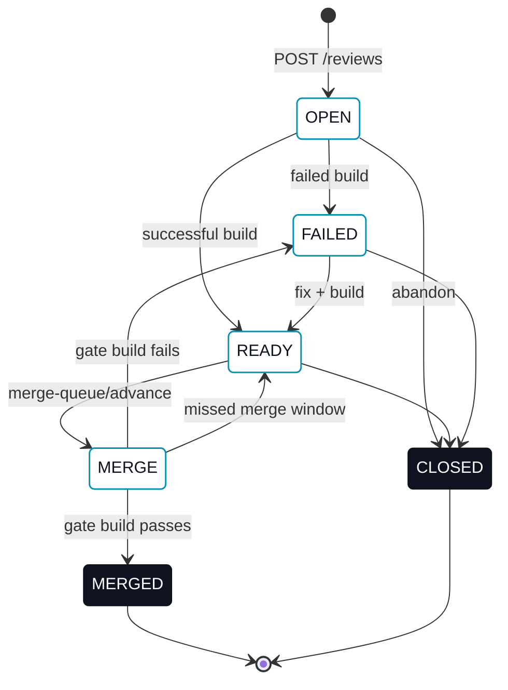

# Reviews

> For the Operator view, see [`erun review`](/cli/review).

A **review** is the unit of work-to-be-merged. It binds a source branch to a target branch and tracks the state of that pairing through to merge.

## Resource shape

```jsonc
{
  "reviewId": "rev_01H...",
  "tenantId": "tnt_01H...",
  "authorUserId": "usr_01H...",           // the caller that created the review; server-derived, never client-set
  "name": "Refactor pricing engine",
  "targetBranch": "main",
  "sourceBranch": "feature-a",
  "status": "OPEN",                       // OPEN | CLOSED | FAILED | READY | MERGE | MERGED
  "lastFailedBuildId": "bld_...",
  "lastReadyBuildId": "bld_...",
  "lastMergedBuildId": "bld_...",
  "createdAt": "2026-05-24T10:42:00Z",
  "updatedAt": "2026-05-24T11:13:00Z"
}
```

`authorUserId` is always the authenticated caller that created the review. A `POST /v1/reviews` body that includes `authorUserId` has it ignored — a client cannot assert authorship for someone else.

## Endpoints

| Method | Path | Description |
|---|---|---|
| `GET` | `/v1/reviews` | List reviews. Optional filters, all composable: `?targetBranch=<name>`, `?sourceBranch=<name>`, `?status=<OPEN\|CLOSED\|FAILED\|READY\|MERGE\|MERGED>`, `?authorUserId=<id>`, `?reviewerUserId=<id>`. |
| `POST` | `/v1/reviews` | Create a review. Body: `name`, `sourceBranch`, `targetBranch`. Refused with `409 Conflict` if another non-`MERGED`/`CLOSED` review already proposes the same `sourceBranch` onto the same `targetBranch`. |
| `GET` | `/v1/reviews/{reviewId}` | Fetch one review. |
| `PATCH` | `/v1/reviews/{reviewId}/status` | Update review status. Body: `status`, `buildId`, and (only for `status: "MERGED"`) `remoteUrl` — the git remote the caller pushed the merge to, fetched to verify the reported commit against the real repository. |
| `GET` | `/v1/reviews/merge-queue` | List reviews *waiting* to merge for a target branch (status `READY`, not yet promoted). Optional `?targetBranch=<name>`. |
| `POST` | `/v1/reviews/merge-queue/advance` | Promote the next waiting review to `MERGE`. Body: `targetBranch`. Refuses with `409 Conflict` when the head still has unresolved comment threads — see [Merge queue](#merge-queue). The promoted review is expected to build and push its own merge and report the outcome; this call does not itself produce `MERGED`. |
| `POST` | `/v1/reviews/merge-queue/override-advance` | Bypass the unresolved-thread refusal and advance anyway. Body: `targetBranch`, `reason`. A distinct, separately-authorized route — see [Overriding the gate](#overriding-the-gate). |
| `GET` | `/v1/reviews/{reviewId}/reviewers` | List the review's reviewers. |
| `POST` | `/v1/reviews/{reviewId}/reviewers` | Add a reviewer. Body: `userId`. |
| `DELETE` | `/v1/reviews/{reviewId}/reviewers/{userId}` | Remove a reviewer. `204 No Content` on success. |

## Author, reviewers, and discovery

Every review has exactly one author and any number of reviewers:

- **Author.** Set once, at creation, to the authenticated caller. It never changes and cannot be reassigned.
- **Reviewers.** Zero or more users explicitly assigned to a review. Assigning a reviewer does not gate any status transition today — `PATCH .../status` still works the same regardless of who (if anyone) is assigned. A reviewer's tenant must match the review's tenant; a cross-tenant `userId` is refused by this API and, on the CLI and MCP clients, before the network call at all (see [`erun review reviewers`](/cli/review#review-reviewers)).

The reviewer resource:

```jsonc
{
  "tenantId": "tnt_01H...",
  "reviewId": "rev_01H...",
  "userId": "usr_01H...",
  "createdAt": "2026-05-24T10:42:00Z",
  "updatedAt": "2026-05-24T11:13:00Z"
}
```

The `authorUserId` and `reviewerUserId` list filters make two questions answerable directly, without client-side filtering: "my reviews" is `GET /v1/reviews?authorUserId=<me>`, and "reviews waiting on me" is `GET /v1/reviews?reviewerUserId=<me>`. Both compose with `status`, `targetBranch`, and `sourceBranch`.

## One live review per branch pair

At most one non-`MERGED`, non-`CLOSED` review may propose a given `sourceBranch` onto a given `targetBranch` at a time. `POST /v1/reviews` for a branch pair that already has a live review fails with `409 Conflict`. Once that review reaches `MERGED` or `CLOSED`, the same branch pair can be proposed again — branch history is unbounded, only *live* duplicates are refused. This prevents two reviews from independently reaching the merge queue for the same change, where the second would merge a branch the target already contains.

## Status lifecycle



The status transitions are enforced server-side: `MERGE` is reached only by promoting a review through `merge-queue/advance` (or its `override-advance` counterpart) — a caller's `PATCH .../status` asserting `MERGE` directly is always refused. `MERGED` is different: it is accepted from `PATCH .../status` from *any* caller — an Agent's own environment reports it, having done the fetch/merge/build/push itself — but only once the platform can verify it against the real repository. `MERGED` means the fact checks out, not that a particular caller asserted it: see [Merge queue § The gate](/collaboration/merge-queue#the-gate) for the three conditions checked before it is accepted.

## Status meanings

| Status | What it means |
|---|---|
| `OPEN` | Review exists, no successful build yet, no decision either way. |
| `FAILED` | The latest build for this review failed. The corresponding build id is stored in `lastFailedBuildId`. |
| `READY` | The latest build succeeded; the review is mergeable. |
| `MERGE` | Promoted to the head of its target branch's queue; whoever promoted it is expected to build the prospective merge, gate it with a build, and push. |
| `MERGED` | A verified merge landed on the target branch. Terminal. `lastMergedBuildId` records the gate build (kind `GATE`; it publishes nothing, so it carries no version — see [Builds](/collaboration/builds)). |
| `CLOSED` | Closed without merge (abandoned). Terminal. |

## Merge queue

`GET /v1/reviews/merge-queue` and `POST /v1/reviews/merge-queue/advance` (and its `override-advance` counterpart) above are the wire contract for the merge queue. For why it exists, the queue's shape, what the gate does, the unresolved-thread check's structured body, advancing and overriding it from every client, and recovering a wedged gate — see **[Merge queue](/collaboration/merge-queue)**.

### Overriding the gate {#overriding-the-gate}

See [Merge queue § Overriding the gate](/collaboration/merge-queue#overriding-the-gate).

## Errors

Every endpoint returns a JSON body `{code, message, details}` — `code` is always present, even where no business-specific value applies (a route with no documented code below gets a generic status-derived one, such as `NOT_FOUND` or `BAD_REQUEST`). The one exception is the merge queue's unresolved-thread refusal, which keeps its own bespoke `{error, message, reviewId, unresolvedThreads}` shape instead — see [Merge queue § The unresolved-thread check](/collaboration/merge-queue#the-unresolved-thread-check).

```jsonc
{
  "code": "INVALID_TRANSITION",
  "message": "cannot transition review from OPEN directly to MERGED",
  "details": { "from": "OPEN", "to": "MERGED", "validTargets": ["FAILED", "READY", "CLOSED"] }
}
```

| Status | When | Example |
|---|---|---|
| `400 Bad Request` | Malformed JSON, missing required fields, type mismatches; a caller asserting `MERGE` directly, or `MERGED` from any status other than `MERGE`; `override-advance` with a blank or missing `reason`; an empty `targetBranch` on merge-queue advance. | `POST /v1/reviews` without `sourceBranch`; `PATCH .../status` with `{"status": "MERGE"}`; `override-advance` with `reason` omitted. |
| `401 Unauthorized` | No `Authorization` header, or token validation failed. | Bearer token expired. |
| `403 Forbidden` | Token valid; caller not allowed in this tenant. | Agent of tenant A calling on tenant B. |
| `404 Not Found` | The review or build id doesn't exist or isn't visible to the caller; a `buildId` on `PATCH .../status` that doesn't belong to the review or whose `successful` flag doesn't match the target status; `merge-queue/advance` against a target branch with nothing waiting to promote, or while another review is already `MERGE` for that target branch — see [Merge queue § Failure table](/collaboration/merge-queue#failure-table). | `GET /v1/reviews/rev_unknown`; `POST /v1/reviews/merge-queue/advance` on an empty queue. |
| `409 Conflict` | A second live review for a branch pair already proposed by a live review; a reviewer already assigned to the review; the queue head has unresolved comment threads; a `MERGED` report the platform could not verify against the real repository. | `POST /v1/reviews` proposing `feature-a` onto `main` while another live review already does; `advance` against a head review with an open thread — see [Merge queue](/collaboration/merge-queue#the-unresolved-thread-check) for that response's structured body; `PATCH .../status` with `{"status": "MERGED"}` whose `buildId`/`remoteUrl` don't check out — see [Merge queue § The gate](/collaboration/merge-queue#the-gate). |
| `429 Too Many Requests` `(Planned.)` | Not implemented — no request ever gets this today. Kept here as the target shape; see [API protocol · Rate limits](/agent-reference/api-protocol#rate-limits). | n/a |
| `500 Internal Server Error` | Server error. Retry. | Database unavailable. |

`422 Unprocessable Entity` does not appear above because nothing in this API returns it — earlier drafts of this page and the machine-code table below described a `422` for a semantically-invalid-but-structurally-valid request, but no route ever produced one; every condition that reads that way in practice is either a `400` (malformed input) or a `404` (a referenced id/state that isn't there).

### Machine error codes

The codes below are the ones this API's review/merge-queue routes can actually distinguish and emit. One code sketched in an earlier draft of this table has been dropped rather than left describing behavior that doesn't exist: `EXPIRED_PAGE_TOKEN` depends on pagination, which is [not implemented](/agent-reference/api-protocol#pagination). `UNKNOWN_COMMIT` — "does this commit exist on the source branch" — is still not a route this API can distinguish for an ordinary `RECORDED` build report (a build/review mismatch on `PATCH /status` is a plain `404` instead, above); a `MERGED` report is the one place the API now does fetch the real repository, covered by `MERGE_NOT_VERIFIED` below.

| `code` | When | HTTP status |
|---|---|---|
| `INVALID_TRANSITION` | `PATCH /status` asserting `MERGE` directly, or `MERGED` from any status other than `MERGE`. `details.from`/`details.to`/`details.validTargets` name the review's current status, the rejected target, and the statuses actually reachable from `from` per the [Status lifecycle](#status-lifecycle). | `400` |
| `MERGE_NOT_VERIFIED` | `PATCH /status` to `MERGED` whose `buildId` and `remoteUrl` do not check out against the real repository — see [Merge queue § The gate](/collaboration/merge-queue#the-gate) for the three conditions checked. | `409` |
| `EMPTY_QUEUE` | `POST /merge-queue/advance` against a target branch whose queue has no `READY` reviews waiting — a review already `MERGE` has left that waiting line, so its presence is the separate "another review already merging" case, not this one (that case is a plain `404` with no code above). | `404` |
| `INVALID_BODY` | Request body missing required field or fails type validation (malformed JSON), or `PATCH /status` to `READY`/`FAILED`/`MERGED` with no `buildId` (`details.field` names it: `buildId`). | `400` |
| `INVALID_TARGET_BRANCH` | `targetBranch` is empty on `merge-queue/advance` or `override-advance`. | `400` |

### Pagination + rate limits

Neither is implemented yet. List endpoints return every matching row in one response — see [API protocol · Pagination](/agent-reference/api-protocol#pagination) — and no request is ever refused for rate; see [API protocol · Rate limits](/agent-reference/api-protocol#rate-limits) for the target design.
