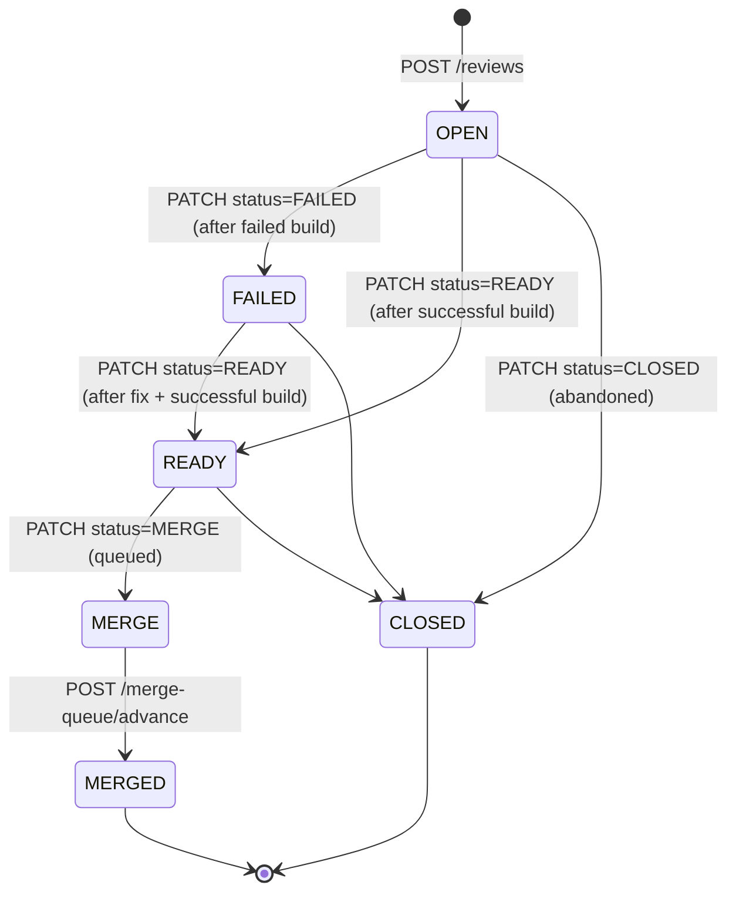

# Reviews

A **review** is the unit of work-to-be-merged. It binds a source branch to a target branch and tracks the state of that pairing through to merge.

## Resource shape

```jsonc
{
  "reviewId": "rev_01H...",
  "tenantId": "tnt_01H...",
  "name": "Refactor pricing engine",
  "targetBranch": "main",
  "sourceBranch": "feature-a",
  "status": "OPEN",                       // OPEN | CLOSED | FAILED | READY | MERGE | MERGED
  "lastFailedBuildId": "bld_...",
  "lastReadyBuildId": "bld_...",
  "lastMergedBuildId": "bld_...",
  "createdAt": "2026-05-24T10:42:00Z",
  "updatedAt": "2026-05-24T11:13:00Z"
}
```

## Endpoints

| Method | Path | Description |
|---|---|---|
| `GET` | `/v1/reviews` | List reviews. Optional `?targetBranch=<name>` filter. |
| `POST` | `/v1/reviews` | Create a review. Body: `name`, `sourceBranch`, `targetBranch`. |
| `GET` | `/v1/reviews/{reviewId}` | Fetch one review. |
| `PATCH` | `/v1/reviews/{reviewId}/status` | Update review status. Body: `status`, `buildId`. |
| `GET` | `/v1/reviews/merge-queue` | List reviews queued to merge (status `MERGE`). Optional `?targetBranch=<name>`. |
| `POST` | `/v1/reviews/merge-queue/advance` | Promote the next queued review to `MERGED`. Body: `targetBranch`. |

## Status lifecycle



The status transitions are enforced server-side: an agent cannot directly mark a review `MERGED`. The only path to `MERGED` is via the merge queue, which `POST /v1/reviews/merge-queue/advance` controls.

## Status meanings

| Status | What it means |
|---|---|
| `OPEN` | Review exists, no successful build yet, no decision either way. |
| `FAILED` | The latest build for this review failed. The corresponding build id is stored in `lastFailedBuildId`. |
| `READY` | The latest build succeeded; the review is mergeable. |
| `MERGE` | Queued for merge. Waiting for the queue to advance to its target branch. |
| `MERGED` | Successfully merged. Terminal. `lastMergedBuildId` records the merging build. |
| `CLOSED` | Closed without merge (abandoned). Terminal. |

## Merge queue

The merge queue is **shared per target branch**. All reviews with status `MERGE` and the same `targetBranch` form a single FIFO. `POST /v1/reviews/merge-queue/advance` advances the head:

```
POST /v1/reviews/merge-queue/advance
Content-Type: application/json

{ "targetBranch": "main" }
```

The server picks the head of the queue for that target branch and transitions it to `MERGED`. The response is the promoted review. If the queue is empty, the API returns an error.

This mechanism gives an organization a single, fair, audit-trail-friendly merge order even when many agents are submitting in parallel.
