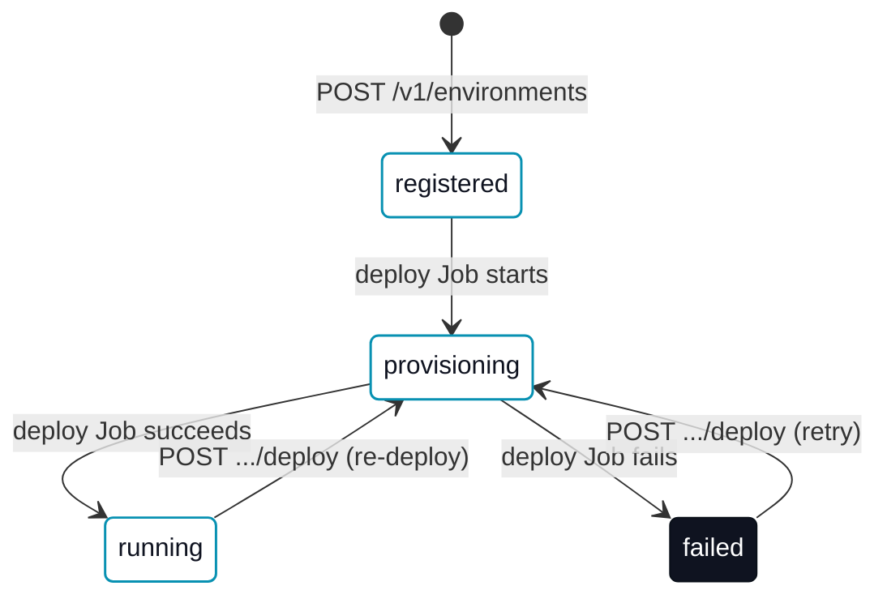

# Hosted platform

A **hosted erun platform** is a deployed `erun-backend-api` plus its database, serving one or more [tenants](/concepts/tenants-and-environments) their own [environments](/concepts/environment-types) over a REST API — the same API the hosted console drives, and the same one [`erun platform`](/cli/platform) talks to directly. This page specs the provisioning model: what a hosted environment's lifecycle looks like, where it is allowed to land today, and what RBAC the control plane provisions it with.

For the Operator-facing walkthrough (creating and managing a hosted environment day to day), see [Managing hosted environments](/collaboration/hosted-environments). For the full route/schema spec, see [erun API protocol](/agent-reference/api-protocol).

## Provisioning lifecycle

A hosted **runtime** environment moves through a small state machine, tracked in `environments.status`:

`registered` is a plain config row with no live infrastructure yet. Registering a runtime environment with a `runtimeVersion` set — or calling `POST .../deploy` on an already-registered one — starts a Kubernetes Job that runs `erun deploy` at that version, and the row moves to `provisioning` while it runs. A `remote-agent`/`local-agent` environment never leaves `registered`: the platform only server-side deploys `runtime` environments.

**Bootstrapping a tenant with no published image.** The Job normally runs inside the tenant's own `<tenant>-devops` runtime image, deploying that same image's chart by reference. Before starting it, the control plane checks whether that image is actually published at the requested version; a tenant that has never run `erun push` — the common case for a brand-new tenant signing in for the first time — has no image to run. Rather than starting a Job that can only `ImagePullBackOff`, the control plane instead runs the Job on the canonical published `erun-devops` image and passes `erun deploy --runtime-image <canonical image>`, the same flag an operator's own machine uses to bootstrap an environment before its project exists ([`erun deploy`](/cli/deploy)). The environment still lands on `<tenant>-<env>` with the release named `<tenant>-devops`; only the underlying image and chart differ. A tenant that publishes its own image and plan keeps getting exactly that — this check never overrides an image that actually exists.

`stop` (`POST .../stop`) and `delete` (`DELETE`) run the same way — a short-lived Job running `erun stop`/`erun delete` — but neither is a `status` transition: a stopped environment stays `running` (scaled to zero, not torn down), and a successful delete removes the row entirely rather than moving it to a terminal status.

## Single-cluster placement (v1) {#single-cluster-placement}

Every deploy/stop/delete Job runs **in the same cluster the control plane's own pod runs in** — it has no mechanism to reach any other cluster, because it authenticates in-cluster via its own ServiceAccount rather than a per-Job kubeconfig. A `runtime` environment therefore cannot name a [cloud context](/cli/context) or kubernetes context to deploy into: `POST /v1/environments` and `POST /v1/provision` both refuse a `runtime` environment that sets `contextId` or `kubernetesContext`, with an actionable `400` naming the constraint, rather than silently accepting and ignoring the field. `remote-agent`/`local-agent` environments — never server-side deployed — are unaffected.

This is a deliberate v1 scope decision, not an oversight: multi-cluster placement (deploying a tenant's runtime environments into their own bootstrapped [cloud context](/concepts/cloud-contexts) instead of the platform's cluster) needs a per-Job credential path that does not exist yet. `(Planned.)`

## Provisioner RBAC

The Job launcher's ServiceAccount (`<tenant>-env-deployer`) is bound to a curated `<tenant>-env-provisioner` `ClusterRole` — not the built-in `cluster-admin` — carrying exactly the verbs a runtime-chart deploy/stop/delete needs: namespace lifecycle, `ResourceQuota`/`LimitRange`, the runtime chart's own namespaced resources (`Deployment`, `PersistentVolumeClaim`, `ServiceAccount`, `Service`, its `Secret`/`ConfigMap`, and Helm's own release-state secrets), and `RoleBinding`s. It is granted `bind` on the single named built-in `admin` ClusterRole (the Kubernetes RBAC escalation-check's documented way to hand out a ClusterRole a granter does not hold outright), rather than the full set of verbs `admin` itself carries. It does not cover a `platformAccount` grant — that stays gated on an operator-driven admin-capable context, unchanged.

## Quotas {#quotas}

`tenant_quotas` carries two kinds of cap, both defaulted when a tenant has no row: `max_environments` (default `10`) is an **aggregate** cap on how many environments a tenant may register — `POST /v1/environments` refuses a create at the cap (`409`), and `POST /v1/provision` reports `quotaOk: false` in the same preview rather than failing the call. `max_cpu_millicores`/`max_memory_mb`/`max_storage_gb` (default `4000`/`9216`/`80`, sized to the `erun-devops` chart's own default runtime pod plus its three default PVCs) are a **per-environment namespace ceiling** — every `runtime` environment this tenant provisions gets its own cap, not a budget split across all of them.

**Enforced by Kubernetes, not just recorded.** The resource caps are threaded from the tenant's quota row into the deploy Job as `erun deploy --max-cpu <cpu> --max-memory <mem> --max-storage <storage>` flags, which apply a `ResourceQuota` (`limits.cpu`, `limits.memory`, `requests.storage`) and a `LimitRange` (default/defaultRequest, so a pod that declares no resources of its own still gets sane values instead of being rejected outright) to the `<tenant>-<env>` namespace at deploy time — `erun-common/kubernetes_resource_quota.go`. Deploy stays a pure primitive: it does not look up quotas itself, it only applies whatever cap the caller (the deploy Job, or an operator's own `erun deploy --max-cpu …`) hands it. A cap of zero on all three (the CLI default) applies no `ResourceQuota`/`LimitRange` at all, so an env with no configured cap deploys exactly as it did before this existed.

**A cap below the runtime pod's own floor is refused before it can fail later.** `POST /v1/environments` checks the tenant's resource caps against the `erun-devops` chart's minimum (cpu `4000m`, memory `8916Mi`, storage `72Gi`) and rejects with `409` — naming which cap — rather than letting the create/deploy succeed and only failing once Kubernetes refuses to admit the pod under its own `ResourceQuota`.

**Usage metering.** `usage_events` records one append-only row per resource-affecting environment lifecycle transition — `environment_provisioned` (with the resource caps applied), `environment_stopped`, `environment_deleted` — readable via [`GET /v1/usage-events`](/agent-reference/api-protocol#get-v1usage-events). It is a small, honest usage trail (a lifecycle audit log), not a billing engine: there is no aggregation, no cost model, and no export pipeline.

## Automatic exposure {#automatic-exposure}

A newly-created runtime environment is reachable at `mcp.<tenant>-<env>.<services zone>` with no follow-up [`erun expose`](/cli/expose) call, whenever the platform is configured for it. The runtime chart renders a `Service` fronting the runtime pod's MCP port (`<tenant>-mcp`, port `80` → the named `mcp` container port), which is what gives `erun expose`'s Ingress something real to route to; when the deploy Job's placement carries a configured ingress IP, it composes the deploy Job's command as `erun deploy <tenant> <env> --version <runtimeVersion> && erun expose <tenant> <env> mcp --ip <ip> --skip-if-unconfigured` rather than teaching `erun deploy` itself about exposure — `deploy` and `expose` both stay pure, single-purpose primitives, and the Job is what composes them.

**Configuring it.** Set the platform's ingress IP as `api.envDeployer.exposeTargetIp` on the `erun-backend-api` chart (rendered as `ERUN_ENV_EXPOSE_TARGET_IP` on the API pod). Unset (the default), every deploy Job stays exactly the plain `erun deploy` it always ran — no attempt to expose, independent of whether the server-side executor itself is enabled.

**Safe on an unconfigured tenant.** `--skip-if-unconfigured` turns expose's usual hard failure for a missing `platform:` block into a traced no-op success. So even with the platform's ingress IP configured, a tenant whose own project declares no platform block deploys with no exposure attempt and no failure — the same "deploy exactly as before" guarantee, scoped per tenant rather than per platform.

**Failure is not silent.** `erun expose` runs as the second half of the same shell chain as `erun deploy`, so a real exposure failure (a platform that *is* configured, whose DNS or Ingress write errors) fails the whole Job. The environment is then recorded `failed` with the reason on `provisionError`, never `running` while actually unreachable.

**Idempotent by construction.** Re-running the deploy Job — an explicit re-deploy, or a workflow resuming after a control-plane restart — re-runs the same `erun expose` call. The underlying writes already converge rather than duplicate: the DNS record is a `replace-rrset`, and the Ingress is a `kubectl apply`. Neither invokes cert-manager — the Ingress only *references* the per-env wildcard cert Secret the cluster edge already issued, so there is nothing for a redeploy to fight.

## See also

- [`erun platform`](/cli/platform) — the CLI/Agent client for this API.
- [Managing hosted environments](/collaboration/hosted-environments) — the Operator walkthrough.
- [erun API protocol](/agent-reference/api-protocol) — full route and error-code spec.
- [Tenants and environments](/concepts/tenants-and-environments), [Cloud contexts](/concepts/cloud-contexts) — the underlying domain model.
