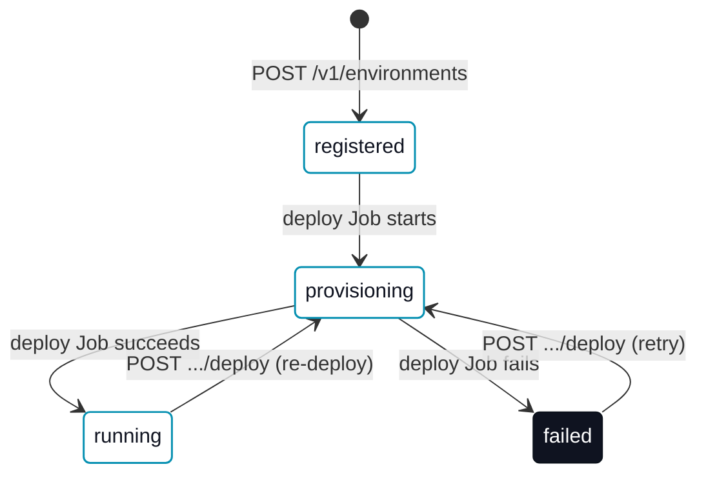

# Hosted platform

A **hosted erun platform** is a deployed `erun-backend-api` plus its database, serving one or more [tenants](/concepts/tenants-and-environments) their own [environments](/concepts/environment-types) over a REST API — the same API the hosted console drives, and the same one [`erun platform`](/cli/platform) talks to directly. This page specs the provisioning model: what a hosted environment's lifecycle looks like, where it is allowed to land today, and what RBAC the control plane provisions it with.

For the Operator-facing walkthrough (creating and managing a hosted environment day to day), see [Managing hosted environments](/collaboration/hosted-environments). For the full route/schema spec, see [erun API protocol](/agent-reference/api-protocol).

## Provisioning lifecycle

A hosted **runtime** environment moves through a small state machine, tracked in `environments.status`:

`registered` is a plain config row with no live infrastructure yet. Registering a runtime environment with a `runtimeVersion` set — or calling `POST .../deploy` on an already-registered one — starts a Kubernetes Job that runs `erun deploy` at that version, and the row moves to `provisioning` while it runs. A `remote-agent`/`local-agent` environment never leaves `registered`: the platform only server-side deploys `runtime` environments.

**Bootstrapping a tenant with no published image.** The Job normally runs inside the tenant's own `<tenant>-devops` runtime image, deploying that same image's chart by reference. Before starting it, the control plane checks whether that image is actually published at the requested version; a tenant that has never run `erun push` — the common case for a brand-new tenant signing in for the first time — has no image to run. Rather than starting a Job that can only `ImagePullBackOff`, the control plane instead runs the Job on the canonical published `erun-devops` image and passes `erun deploy --runtime-image <canonical image>`, the same flag an operator's own machine uses to bootstrap an environment before its project exists ([`erun deploy`](/cli/deploy)). The environment still lands on `<tenant>-<env>` with the release named `<tenant>-devops`; only the underlying image and chart differ. A tenant that publishes its own image and plan keeps getting exactly that — this check never overrides an image that actually exists.

The check runs **with the registry credential the deploy Job itself pulls with** (the platform namespace's image-pull secret, named to the control plane by the `erun-backend-api` chart). That is what makes it decisive rather than advisory: a private registry namespace — the normal case for a tenant's own runtime image — answers an anonymous caller identically whether the image is absent or merely invisible, so an unauthenticated probe can never confirm absence. The credential is proven in the same pass by probing the canonical `erun-devops` image at the same version, which this deploy already depends on resolving; only a credential that reads *that* makes a "not found" for the tenant image meaningful. Every other outcome — no credential configured, an unreachable registry, a non-GHCR host — is treated as inconclusive and leaves the deploy on the tenant's own image, so an inconclusive probe never diverts a deploy.

`stop` (`POST .../stop`) and `delete` (`DELETE`) run the same way — a short-lived Job running `erun stop`/`erun delete` — but neither is a `status` transition: a stopped environment stays `running` (scaled to zero, not torn down), and a successful delete removes the row entirely rather than moving it to a terminal status.

## Placement {#single-cluster-placement}

A deploy/stop/delete Job always runs **in the control plane's own cluster** — that never changes — but the `erun` command it runs can now authenticate against a **different** cluster: its own bootstrapped [cloud context](/concepts/cloud-contexts). The Job seeds a kubeconfig pointing at the placed context's cluster (its public API server, over the context's own custodied k3s admin-token credential) instead of the in-cluster ServiceAccount token it uses for the platform's own cluster, and every subsequent `erun deploy`/`stop`/`delete` call inside the Job runs against that cluster.

**Where an environment lands.** A `runtime` environment names its target with `contextId` (a context this tenant has already registered via [`POST /v1/contexts`](/agent-reference/api-protocol#post-v1contexts)):

- **An explicit `contextId`** is validated to belong to the caller's tenant and to have room, then placed there. An unknown or cross-tenant id is a `400`; a full context is a `409` naming the context and its ceiling.
- **No `contextId`** auto-selects the first of the tenant's own registered, `running` contexts with room. A tenant that has registered no context at all keeps the original default — the platform's own cluster — so this is fully backward compatible for every tenant that has never bootstrapped one.
- **Once a tenant has registered at least one context**, exhausting all of them (none running, or all full) is a `409` naming why, rather than silently falling back to the platform's own cluster — a placement the caller never asked for.
- A raw `kubernetesContext` string (as opposed to a registered `contextId`) is still refused with `400`: it names no known credential to authenticate with.

`remote-agent`/`local-agent` environments — never server-side deployed — are unaffected by any of this.

**Capacity.** Each context names its own placement ceiling, `maxEnvironments` (default `20`, operator-settable per context at creation) — the per-instance inventory this feature reads from; adding a cluster to the inventory is a `POST /v1/contexts` call, not a code change.

**Credential custody.** The context's k3s admin token is decrypted from `context_credentials` immediately before each Job run — never persisted in the durable provisioning workflow's own checkpoint — and handed to the Job through a Kubernetes `Secret` the control plane's own identity creates in its own namespace, referenced by the Job container via `secretKeyRef`. The token itself never appears in the Job's spec, command line, or logs.

## Provisioner RBAC

The Job launcher's ServiceAccount (`<tenant>-env-deployer`) is bound to a curated `<tenant>-env-provisioner` `ClusterRole` — not the built-in `cluster-admin` — carrying exactly the verbs a runtime-chart deploy/stop/delete needs: namespace lifecycle, `ResourceQuota`/`LimitRange`, the runtime chart's own namespaced resources (`Deployment`, `PersistentVolumeClaim`, `ServiceAccount`, `Service`, its `Secret`/`ConfigMap`, and Helm's own release-state secrets), and `RoleBinding`s. It is granted `bind` on the single named built-in `admin` ClusterRole (the Kubernetes RBAC escalation-check's documented way to hand out a ClusterRole a granter does not hold outright), rather than the full set of verbs `admin` itself carries. It does not cover a `platformAccount` grant — that stays gated on an operator-driven admin-capable context, unchanged.

The control plane's own ServiceAccount (`<tenant>-api`) is separate and narrower: namespaced `Job` management plus `pods`/`pods/log` reads, and — only when the environment configures image-pull secrets — `get` on those secrets **by name**, which is the credential the published-image check above probes with. It holds no other access to the namespace's secrets.

## Quotas {#quotas}

`tenant_quotas` carries two kinds of cap, both defaulted when a tenant has no row: `max_environments` (default `10`) is an **aggregate** cap on how many environments a tenant may register — `POST /v1/environments` refuses a create at the cap (`409`), and `POST /v1/provision` reports `quotaOk: false` in the same preview rather than failing the call. `max_cpu_millicores`/`max_memory_mb`/`max_storage_gb` (default `8000`/`17832`/`72`, sized to the `erun-devops` chart's own default runtime pod summed across **both** its containers — `erun-devops` and the `erun-dind` sidecar — plus its three default PVCs) are a **per-environment namespace ceiling** — every `runtime` environment this tenant provisions gets its own cap, not a budget split across all of them.

**Enforced by Kubernetes, not just recorded.** The resource caps are threaded from the tenant's quota row into the deploy Job as `erun deploy --max-cpu <cpu> --max-memory <mem> --max-storage <storage>` flags, which apply a `ResourceQuota` (`limits.cpu`, `limits.memory`, `requests.storage`) and a `LimitRange` (default/defaultRequest, so a pod that declares no resources of its own still gets sane values instead of being rejected outright) to the `<tenant>-<env>` namespace at deploy time — `erun-common/kubernetes_resource_quota.go`. Deploy stays a pure primitive: it does not look up quotas itself, it only applies whatever cap the caller (the deploy Job, or an operator's own `erun deploy --max-cpu …`) hands it. A cap of zero on all three (the CLI default) applies no `ResourceQuota`/`LimitRange` at all, so an env with no configured cap deploys exactly as it did before this existed.

**A cap below the runtime pod's own floor is refused before it can fail later.** A `ResourceQuota` counts every container in the pod, so the floor is the `erun-devops` chart's minimum summed across both the `erun-devops` and `erun-dind` containers (cpu `8000m`, memory `17832Mi`, storage `72Gi`) — not one container's own limits. `POST /v1/environments` checks the tenant's resource caps against this floor and rejects with `409` — naming which cap and by how much it falls short — rather than letting the create succeed and only failing once Kubernetes refuses to admit the pod under its own `ResourceQuota`. `POST /v1/environments/{id}/deploy` re-checks the same floor, since an operator can lower a tenant's quota after the environment already exists.

**Both containers count, and both now size themselves.** Before this floor existed, the `erun-dind` sidecar declared no resources of its own, so the namespace `LimitRange`'s default/defaultRequest — meant as a fallback for a container that forgot to size itself — silently assigned it the *entire* configured quota width, on top of whatever the `erun-devops` container already declared. A stock two-container pod under the old one-container-sized default quota could never admit itself. `erun-dind` now declares explicit limits/requests in the chart (mirroring `erun-devops`'s own), and the tenant-quota defaults and this floor are both derived from one shared function (`eruncommon.MinimumRuntimeNamespaceQuota`) so a future change to either container's shape, or to the chart's PVC sizes, moves the floor with it instead of quietly falling behind again.

**Why the runtime pod is not exempt from this quota.** The quota conceptually exists to bound what a tenant runs *inside* its environment, and the runtime pod is erun's own mandatory infrastructure rather than tenant-chosen workload — so exempting it (e.g. via a Kubernetes `PriorityClass` scope selector) was considered. It was rejected: the only things that land as additional pods in an environment's namespace today are the tenant's own opt-in Helm components (`erun-backend-postgres`, `-db`, `-api`, `-zitadel`, `-docs`), which are themselves erun infrastructure the tenant merely chose to enable, not arbitrary third-party workload — a genuinely untrusted tenant container never becomes a Kubernetes pod here, since anything a tenant builds or runs through `docker`/`docker compose` executes inside the `erun-dind` sidecar's own daemon, invisible to a namespace `ResourceQuota` either way. Splitting the quota into "erun infrastructure" and "tenant workload" would not change what is actually enforceable at the pod level, so a single quota — correctly sized to the pod that must always fit inside it — is the simpler, lower-risk model.

**Usage metering.** `usage_events` records one append-only row per resource-affecting environment lifecycle transition — `environment_provisioned` (with the resource caps applied), `environment_stopped`, `environment_deleted` — readable via [`GET /v1/usage-events`](/agent-reference/api-protocol#get-v1usage-events). It is a small, honest usage trail (a lifecycle audit log), not a billing engine: there is no aggregation, no cost model, and no export pipeline.

## Automatic exposure {#automatic-exposure}

A newly-created runtime environment is reachable at `mcp.<tenant>-<env>.<services zone>` with no follow-up [`erun expose`](/cli/expose) call, whenever the platform is configured for it. The runtime chart renders a `Service` fronting the runtime pod's MCP port (`<tenant>-mcp`, port `80` → the named `mcp` container port), which is what gives `erun expose`'s Ingress something real to route to; when the deploy Job's placement carries a configured ingress IP, it composes the deploy Job's command as `erun deploy <tenant> <env> --version <runtimeVersion> && erun expose <tenant> <env> mcp --ip <ip> --skip-if-unconfigured` rather than teaching `erun deploy` itself about exposure — `deploy` and `expose` both stay pure, single-purpose primitives, and the Job is what composes them.

**Configuring it.** Set the platform's ingress IP as `api.envDeployer.exposeTargetIp` on the `erun-backend-api` chart (rendered as `ERUN_ENV_EXPOSE_TARGET_IP` on the API pod). Unset (the default), every deploy Job stays exactly the plain `erun deploy` it always ran — no attempt to expose, independent of whether the server-side executor itself is enabled.

**Safe on an unconfigured tenant.** `--skip-if-unconfigured` turns expose's usual hard failure for a missing `platform:` block into a traced no-op success. So even with the platform's ingress IP configured, a tenant whose own project declares no platform block deploys with no exposure attempt and no failure — the same "deploy exactly as before" guarantee, scoped per tenant rather than per platform.

**Failure is not silent, but it doesn't take the deploy down either.** Exposure is best-effort: a real exposure failure (a platform that *is* configured, whose DNS or Ingress write errors) does not fail the deploy Job, since the runtime itself already landed and is genuinely running. The Job's shell chain catches the failure and captures expose's own output; the environment is recorded `running` with the reason on `exposeError`, so an operator can see the environment is up but not reachable at its public hostname, instead of a healthy environment being misreported as a failed provision.

**Idempotent by construction.** Re-running the deploy Job — an explicit re-deploy, or a workflow resuming after a control-plane restart — re-runs the same `erun expose` call. The underlying writes already converge rather than duplicate: the DNS record is a `replace-rrset`, and the Ingress is a `kubectl apply`.

**Torn down on delete.** The DNS record `erun expose` writes has no owner once the environment row that would tell you whether it is still live is gone, so a successful `erun delete` Job chains a best-effort `erun unexpose` (#1094) that removes it, symmetric with the deploy Job chaining `erun expose` itself. A cleanup failure does not fail the delete — the namespace already tore down successfully by that point — it is logged on the control plane instead, since there is no environment row left to record it against once delete returns.

## Per-env TLS certificate provisioning {#per-env-tls}

The Ingress `erun expose` applies references a per-env wildcard TLS Secret (`<tenant>-<env>-wildcard-tls`) by default — but referencing a Secret doesn't create one. When the platform's DNS-01 broker is configured (the same broker `api.dns01.enabled` turns on for the platform's own certificate issuance), the deploy Job's chained `erun expose` also provisions a namespaced cert-manager `Issuer` and `Certificate` into the environment's own namespace, scoped to a per-env token that only authorizes ACME challenge writes within that environment's own subzone — so one tenant's environment can never prove control of another's hostnames even though every environment's certificate is issued through the same central broker.

**Configuring it.** Set `api.acmeEmail` (required) on the `erun-backend-api` chart; `api.acmeServer` and `api.dns01WebhookGroupName` default to Let's Encrypt production and the cluster's DNS-01 webhook shim's own default group name. The broker URL is derived automatically from the backend's own public API URL — the same backend that serves the DNS-01 broker's `/v1/dns01` endpoints. Unset `api.acmeEmail` (the default), and every deploy Job skips TLS provisioning entirely: the Ingress still references the wildcard Secret, nothing populates it, and the environment serves the ingress controller's own self-signed certificate — exactly as before this existed.

**Requires the cluster's DNS-01 webhook shim.** The per-env `Issuer` this provisions forwards its ACME challenges through the cluster-wide cert-manager webhook shim (`terraform-erun-cluster-edge`'s `dns01_provider = "powerdns-broker"` mode) — a one-time, per-cluster Terraform apply, not something a per-env deploy can install for itself. Without that shim already running, the `Issuer` this creates never becomes `Ready` and the certificate never issues; the environment stays reachable over http (or the ingress controller's default self-signed certificate for https) until the shim is installed.

**Failure is not silent here either.** Minting the per-env token or applying the `Issuer`/`Certificate` is chained into the same best-effort `erun expose` step as the DNS/Ingress writes above — a failure surfaces on `exposeError` without failing the deploy.

## See also

- [`erun platform`](/cli/platform) — the CLI/Agent client for this API.
- [Managing hosted environments](/collaboration/hosted-environments) — the Operator walkthrough.
- [erun API protocol](/agent-reference/api-protocol) — full route and error-code spec.
- [Tenants and environments](/concepts/tenants-and-environments), [Cloud contexts](/concepts/cloud-contexts) — the underlying domain model.
