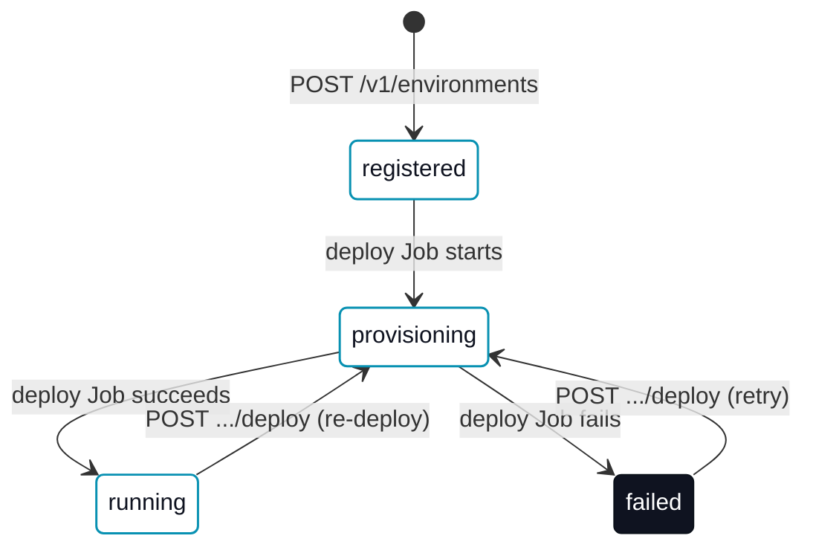

# Hosted platform

A **hosted erun platform** is a deployed `erun-backend-api` plus its database, serving one or more [tenants](/concepts/tenants-and-environments) their own [environments](/concepts/environment-types) over a REST API — the same API the hosted console drives, and the same one [`erun platform`](/cli/platform) talks to directly. This page specs the provisioning model: what a hosted environment's lifecycle looks like, where it is allowed to land today, and what RBAC the control plane provisions it with.

For the Operator-facing walkthrough (creating and managing a hosted environment day to day), see [Managing hosted environments](/collaboration/hosted-environments). For the full route/schema spec, see [erun API protocol](/agent-reference/api-protocol).

## Provisioning lifecycle

A hosted **runtime** environment moves through a small state machine, tracked in `environments.status`:

`registered` is a plain config row with no live infrastructure yet. Registering a runtime environment with a `runtimeVersion` set — or calling `POST .../deploy` on an already-registered one — starts a Kubernetes Job that runs `erun deploy` inside the tenant's own `<tenant>-devops` runtime image, and the row moves to `provisioning` while it runs. A `remote-agent`/`local-agent` environment never leaves `registered`: the platform only server-side deploys `runtime` environments.

`stop` (`POST .../stop`) and `delete` (`DELETE`) run the same way — a short-lived Job running `erun stop`/`erun delete` — but neither is a `status` transition: a stopped environment stays `running` (scaled to zero, not torn down), and a successful delete removes the row entirely rather than moving it to a terminal status.

## Single-cluster placement (v1) {#single-cluster-placement}

Every deploy/stop/delete Job runs **in the same cluster the control plane's own pod runs in** — it has no mechanism to reach any other cluster, because it authenticates in-cluster via its own ServiceAccount rather than a per-Job kubeconfig. A `runtime` environment therefore cannot name a [cloud context](/cli/context) or kubernetes context to deploy into: `POST /v1/environments` and `POST /v1/provision` both refuse a `runtime` environment that sets `contextId` or `kubernetesContext`, with an actionable `400` naming the constraint, rather than silently accepting and ignoring the field. `remote-agent`/`local-agent` environments — never server-side deployed — are unaffected.

This is a deliberate v1 scope decision, not an oversight: multi-cluster placement (deploying a tenant's runtime environments into their own bootstrapped [cloud context](/concepts/cloud-contexts) instead of the platform's cluster) needs a per-Job credential path that does not exist yet. `(Planned.)`

## Provisioner RBAC

The Job launcher's ServiceAccount (`<tenant>-env-deployer`) is bound to a curated `<tenant>-env-provisioner` `ClusterRole` — not the built-in `cluster-admin` — carrying exactly the verbs a runtime-chart deploy/stop/delete needs: namespace lifecycle, `ResourceQuota`/`LimitRange`, the runtime chart's own namespaced resources (`Deployment`, `PersistentVolumeClaim`, `ServiceAccount`, `Service`, its `Secret`/`ConfigMap`, and Helm's own release-state secrets), and `RoleBinding`s. It is granted `bind` on the single named built-in `admin` ClusterRole (the Kubernetes RBAC escalation-check's documented way to hand out a ClusterRole a granter does not hold outright), rather than the full set of verbs `admin` itself carries. It does not cover a `platformAccount` grant — that stays gated on an operator-driven admin-capable context, unchanged.

## Quotas

`tenant_quotas.max_environments` caps how many environments a tenant may register; `POST /v1/environments` refuses a create at the cap (`409`), and `POST /v1/provision` reports `quotaOk: false` in the same preview rather than failing the call. CPU/memory/storage caps applied as a `ResourceQuota`/`LimitRange` on the provisioned namespace, and usage metering, are `(Planned.)`.

## Automatic exposure

Making a newly-created runtime environment reachable at `mcp.<tenant>-<env>.services.<zone>` without a follow-up [`erun expose`](/cli/expose) call is `(Planned.)`. Today the runtime chart renders no `Ingress` for a hosted environment, and DNS + certificate provisioning remain a manual step after deploy.

## See also

- [`erun platform`](/cli/platform) — the CLI/Agent client for this API.
- [Managing hosted environments](/collaboration/hosted-environments) — the Operator walkthrough.
- [erun API protocol](/agent-reference/api-protocol) — full route and error-code spec.
- [Tenants and environments](/concepts/tenants-and-environments), [Cloud contexts](/concepts/cloud-contexts) — the underlying domain model.
