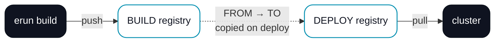
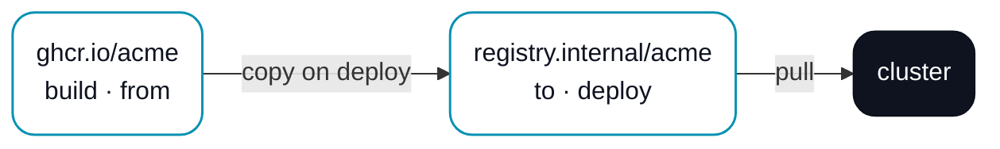

# Container registries

A project keeps a **list** of container registries, and each one is marked with the role it plays in the build → copy → deploy flow. One registry is where images are built and pushed; another can be where a cluster pulls from; ERun mirrors images between them on deploy when you ask it to.

## The four roles

Every registry in the list carries one or more roles. They map onto the three things ERun does with an image — build it, move it, run it.

<figure className="erun-hero-figure">

<figcaption>Build pushes to BUILD. On deploy, ERun copies the image from FROM to TO, and the cluster pulls from DEPLOY.</figcaption>
</figure>

- **BUILD** — where `erun build` and `erun push` push images. Exactly one registry can hold this role. An environment whose list marks no BUILD registry **cannot build**.
- **FROM** — the source ERun copies images from on deploy. At most one.
- **TO** — the destination(s) ERun copies images to on deploy. Any number.
- **DEPLOY** — the registry the cluster pulls from. At least one registry must hold this role.

A registry usually wears more than one hat. The simplest project has a single registry marked **build + deploy**: you build and the cluster pulls from the same place, and nothing is copied. That is the default a fresh project starts with.

You edit the list per environment in the desktop app's environment settings (the **General** tab) — add a row, type the registry host, and tick the roles it should carry — or directly in the project's `.erun/config.yaml`. The desktop checks the role rules as you edit and won't save an invalid list.

## Copying images on deploy

When you want the cluster to pull from a different registry than the one you build into — a private mirror close to the cluster, say — mark a **FROM** and a **TO**. On every deploy ERun mirrors each image the cluster needs (the runtime image and any component images) from FROM to TO before rolling the release, then points the cluster at the **DEPLOY** registry.

<figure className="erun-hero-figure">

<figcaption>Build into the public registry, copy to the near-cluster mirror, pull from the mirror.</figcaption>
</figure>

The copy is manifest-aware, so the runtime image's `linux/amd64` + `linux/arm64` manifest survives the mirror. A FROM and a TO must name different registries — copying a registry into itself does nothing — and a copy only runs when both roles are set.

## Discovering versions to deploy

When the desktop offers versions to deploy or upgrade, it asks only the environment's listed registries — not a global default — and labels each offered version with the registry it came from. If two registries publish different newer versions, the deploy picker and the Upgrade-all dialog let you pick which one; `erun upgrade` on the command line skips such an environment as ambiguous until you pass `--version`. See [`erun upgrade`](/cli/upgrade).

Version discovery uses the same local registry credentials as build and deploy (see [Authentication](#authentication)), so a **private** runtime image's versions appear only once you are logged in to its registry. When the desktop cannot list an image — a private one you have not authenticated to, or an unreachable registry — it shows a notice under the version picker naming the image and how to sign in, instead of silently offering nothing.

## Multi-architecture builds

Every `erun build`, `erun build --release`, and `erun deploy` produces both `linux/amd64` and `linux/arm64`. There is no single-arch code path — that avoids developer-machine builds that work locally but fail on a foreign-arch cluster. The cluster runs binfmt/qemu so the foreign arch builds inside the dind sidecar.

## Authentication

- **ghcr.io** — `gh auth login` (and a `write:packages` token scope) covers it.
- **AWS ECR** — the cluster's IRSA role grants the runtime pod permission to push; for local `docker push` you use a profile via `aws ecr get-login-password`.
- **Other registries** — `docker login` once; credentials are persisted at `~/.docker/config.json`.

## Where next

- [Build, release, deploy](/pipeline) — where build and deploy sit in the larger flow.
- [Configuration reference · Container registries](/reference/configuration#container-registries) — the exact list shape, role rules, and resolution order.
