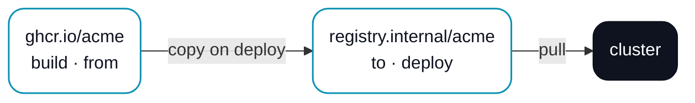

# Container registries

A project keeps a **list** of container registries, and each one is marked with the role it plays in the build → copy → deploy flow. One registry is where images are built and pushed; another can be where a cluster pulls from; ERun mirrors images between them on deploy when you ask it to.

## The four roles

Every registry in the list carries one or more roles. They map onto the three things ERun does with an image — build it, move it, run it.

<figure className="erun-hero-figure">


<figcaption>Build pushes to BUILD. On deploy, ERun copies the image from FROM to TO, and the cluster pulls from DEPLOY.</figcaption>
</figure>

- **BUILD** — where `erun build` and `erun push` push images. Exactly one registry can hold this role. An environment whose list marks no BUILD registry **cannot build**.
- **FROM** — the source ERun copies images from on deploy. At most one.
- **TO** — the destination(s) ERun copies images to on deploy. Any number.
- **DEPLOY** — the registry the cluster pulls from. At least one registry must hold this role.

A registry usually wears more than one hat. The simplest project has a single registry marked **build + deploy**: you build and the cluster pulls from the same place, and nothing is copied. That is the default a fresh project starts with.

You edit the list per environment in the desktop app's environment settings (the **General** tab) — add a row, type the registry host, and tick the roles it should carry — or directly in the project's `.erun/config.yaml`. The desktop checks the role rules as you edit and won't save an invalid list.

## Copying images on deploy

When you want the cluster to pull from a different registry than the one you build into — a private mirror close to the cluster, say — mark a **FROM** and a **TO**. On every deploy ERun mirrors each image the cluster needs (the runtime image and any component images) from FROM to TO before rolling the release, then points the cluster at the **DEPLOY** registry.

<figure className="erun-hero-figure">



<figcaption>Build into the public registry, copy to the near-cluster mirror, pull from the mirror.</figcaption>
</figure>

The copy is manifest-aware, so the runtime image's `linux/amd64` + `linux/arm64` manifest survives the mirror. A FROM and a TO must name different registries — copying a registry into itself does nothing — and a copy only runs when both roles are set.

## Cluster registries (resolved from the context)

A registry entry can name an **in-cluster** registry instead of a static host, and ERun resolves its address from the environment's kube-context. This is what lets a **remote-agent** environment — whose build runs inside a pod — use a registry that lives in its own cluster: a pod's `localhost` is its own loopback, not the node, so the registry has to be addressed by something the pod can reach.

```yaml
# .erun/config.yaml → environments.<env>.containerregistries
containerregistries:
  - cluster: { service: erun-registry, namespace: kube-system, port: 5000, insecure: true }
    roles: [build, deploy]
```

ERun resolves the entry into two concrete hosts, matching the `build`/`deploy` split above:

- **DEPLOY (pull)** → the registry Service's **ClusterIP**, rendered into the chart as `containerRegistry`. Node containerd pulls it (for a plain-HTTP dev registry, the node must list that address as an insecure mirror in `registries.yaml`).
- **BUILD (push)** → the **ClusterIP directly** for an in-pod (remote-agent) build, or an automatic `kubectl port-forward` to `localhost:<port>` for a host build. The same registry backend fronts both, so what you push is what the cluster pulls.

`insecure: true` marks the registry as plain HTTP, so `erun deploy` passes `--insecure-registry <ClusterIP>:5000` to the in-pod dind daemon (which otherwise only trusts loopback). The fields default to the `erun-registry`/`kube-system`/`5000` convention, so a bare `cluster: {}` resolves for the standard local setup. The `erun-setup-k3s-cluster` skill provisions the ClusterIP Service and the node mirror.

## Discovering versions to deploy

When the desktop offers versions to deploy or upgrade, it asks only the environment's listed registries — not a global default — and labels each offered version with the registry it came from. If two registries publish different newer versions, the deploy picker and the Upgrade-all dialog let you pick which one; `erun upgrade` on the command line skips such an environment as ambiguous until you pass `--version`. See [`erun upgrade`](/cli/upgrade).

Version discovery reads the registry directly, whichever registry it is: Docker Hub, ghcr.io, or any host that speaks the OCI distribution API -- a private mirror, an in-cluster registry, or an ECR account. It uses the same local registry credentials as build and deploy (see [Authentication](#authentication)), so a **private** runtime image's versions appear once you are logged in to its registry; for ECR it mints its own credential from the AWS CLI when no docker credential is available, because an ECR token expires after twelve hours. A momentary registry hiccup is retried a few times first, so a transient blip doesn't strand a tenant environment on the upstream fallback. Only when the desktop still cannot list an image — a private one you have not authenticated to, or an unreachable registry — does it show a notice under the version picker naming the image and how to sign in, instead of silently offering nothing.

## Multi-architecture builds

Every `erun build`, `erun build --release`, and `erun deploy` produces both `linux/amd64` and `linux/arm64`. There is no single-arch code path — that avoids developer-machine builds that work locally but fail on a foreign-arch cluster. The cluster runs binfmt/qemu so the foreign arch builds inside the dind sidecar.

## Authentication

- **ghcr.io** — `gh auth login` (and a `write:packages` token scope) covers it. On a machine where keychain or subprocess access is restricted, set `GH_TOKEN` (or `GITHUB_TOKEN`) instead — the desktop reads it directly, with no keychain or `gh` dependency.
- **AWS ECR** — the cluster's IRSA role grants the runtime pod permission to push; for local `docker push` you use a profile via `aws ecr get-login-password`. Version listing falls back to that same command when the docker credential is missing or expired, so the version picker keeps working without a fresh `docker login`. If the runtime image itself is in ECR, `erun deploy` uses the same fallback to keep the [pull secret](/reference/configuration#advanced-image-pull-secrets) fresh across the token's twelve-hour expiry.
- **Other registries** — `docker login` once; credentials are persisted at `~/.docker/config.json`.

A **build-capable or deploy-capable environment's pod authenticates for itself** — the credential lives on whichever machine runs `erun build`/`erun push`/`erun deploy`, which for a `local-agent` or `remote-agent` environment is the pod, not your laptop. For a ghcr.io registry, `erun init` closes that gap automatically: before deploying the pod, it resolves a credential via the same three routes above from *your* machine, and if one resolves, mints a Kubernetes Secret and mounts it into the pod, which merges it into its own `~/.docker/config.json` on boot without overwriting anything already there. Right after deploying the pod, init then checks — directly inside it — that one of the three routes now resolves; if none does (your machine had nothing to provision, and the pod had nothing of its own either), init refuses rather than reporting success, so a missing credential surfaces immediately instead of after a wasted build at the first `erun release`. Authenticate the pod (`erun open`, then `gh auth login` or `docker login`) and re-run `erun init` to confirm.

## Where next

- [Build, release, deploy](/pipeline) — where build and deploy sit in the larger flow.
- [Configuration reference · Container registries](/reference/configuration#container-registries) — the exact list shape, role rules, and resolution order.
