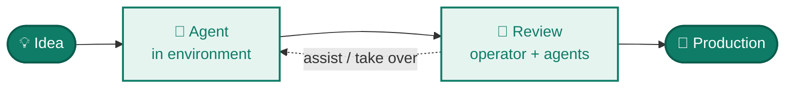
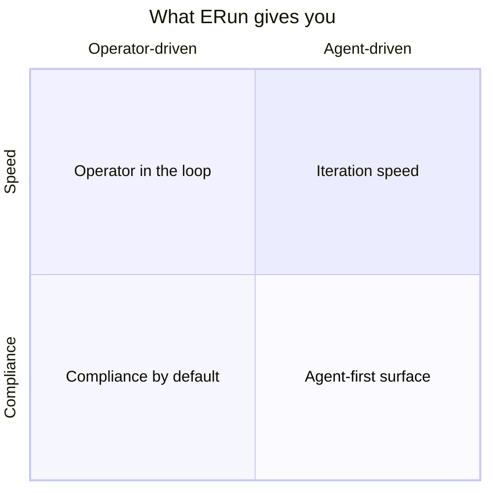

# ERun

> **Agentic coding from idea to production — with the operator in control.**



ERun is the platform layer beneath agentic coding. It gives every agent an isolated environment, gives every operator a full audit trail and a one-command take-over, and ships production-grade Kubernetes deploys — without compromising on compliance or industry best practices.

## The four commitments



- 🤖 **Agent-first** — structured MCP in every env, `--dry-run` as contract, `AGENTS.md` everywhere.
- 👤 **[Operator in the loop](/collaboration/operator-in-the-loop)** — join any env, full audit, easy take-over.
- ⚡ **Iteration speed** — snapshot vs release tags, fingerprint cache, idle-stop.
- 🛡 **Compliance by default** — immutable releases, per-env isolation, multi-arch as a release gate.

## Two commands to get started

```bash
erun init my-tenant local
erun open my-tenant local
```

You now have an isolated Kubernetes environment with your repo checked out, Docker-in-Docker, Helm, kubectl, an MCP endpoint for AI tooling, and a shell. Run as many in parallel as your machine can host — one per agent, per feature branch, per teammate.

## Where next

→ **[Why ERun](/why)** — the design principles in depth.
→ **[First environment](/getting-started/first-environment)** — try it now.
→ **[Agent collaboration](/collaboration/overview)** — how multiple agents (and operators) work together via the erun API.

[github.com/sophium/erun](https://github.com/sophium/erun)
