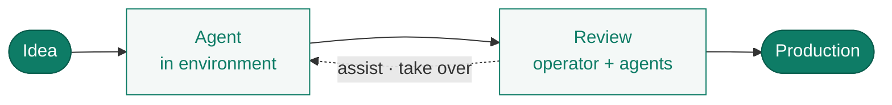

# ERun

**Agentic coding from idea to production — with the operator in control.**

ERun is the platform layer beneath agentic coding. It gives every agent an isolated environment, gives every operator a full audit trail and a one-command take-over, and ships production-grade Kubernetes deploys without compromising on compliance or industry best practices.

---

## How work flows



---

## The four commitments

**Agent-first surface.** Every environment exposes a structured MCP server. `--dry-run` returns trace lines identical to a real run. `AGENTS.md` files in each module encode the rules — read by humans and agents alike.

**Operator in the loop.** The operator can `erun open` any agent's environment, see live activity, replay the full audit trail, take over, or hand back. Agent autonomy expands as the audit accumulates evidence — never by removing the operator. → [Operator in the loop](/collaboration/operator-in-the-loop).

**Iteration speed.** Snapshot tags for local iteration; immutable release tags for promotion. Fingerprint cache means fresh clones promote pinned bases without rebuilding. Idle-stop means you don't pay for cloud compute while you sleep.

**Compliance by default.** Multi-architecture builds verified at developer-machine time. Per-environment Kubernetes isolation. Cloud contexts bound to specific accounts, regions, and IAM roles. Every action — CLI or API — is audited.

---

## Get started

Two commands give you a working environment.

```bash
erun init my-tenant local
erun open my-tenant local
```

You now have an isolated Kubernetes namespace with your repo checked out, Docker-in-Docker, Helm, kubectl, an MCP endpoint for AI tooling, and a shell. Run as many environments in parallel as your machine can host — one per agent, per feature branch, per teammate.

---

## Where next

- **[Why ERun](/why)** — design principles in detail.
- **[Create your first environment](/getting-started/first-environment)** — a five-minute walkthrough.
- **[Agent collaboration](/collaboration/overview)** — multi-agent workflows via the erun API.

ERun is open source under [github.com/sophium/erun](https://github.com/sophium/erun).
