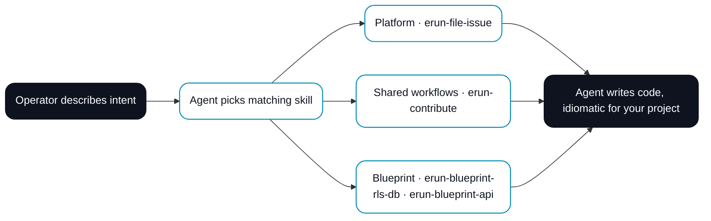

# ERun

**Frictionless agentic coding.**

<figure className="erun-hero-figure">
  
  <figcaption>ERun is the control plane behind parallel development. Three ways to drive it (desktop app, terminal, AI agent), and a fleet of isolated environments — in each one, you and an Agent work side by side.</figcaption>
</figure>

Brooks's law still applies — nine Agents can't deliver tomorrow's design today. But for the work that *can* be split up (different features, different bug fixes, different services), one Operator plus ERun ships what used to take a team.

## The problem

Even before AI agents, operators struggled to run more than one copy of their dev stack on the same machine. Port conflicts, shared databases, daemons fighting over the host — switching branches meant tearing the world down. Everyone hits this:

- **Peer review lands mid-feature.** Their branch needs your stack — but your stack is busy.
- **Emergency hotfix while you're building.** Tear the env down, stand up a clean one, fix, deploy, dance back. Hours on plumbing, not code.
- **Integration tests serialize on CI.** Your laptop only has one stack, so the PR queues behind the build server. Fail → fix → push → wait.

`git worktree` solves the *file* side. ERun solves the *runtime* side — every environment is its own Kubernetes namespace with the full stack inside.

<figure className="erun-hero-figure">
  
  <figcaption>One stack = one task at a time. A namespace per task = all in parallel.</figcaption>
</figure>

## Under the hood

Kubernetes is the right primitive for production, but exposed raw it's overwhelming. ERun gives the Agent and your IDE everything they need to work in an env without dealing with the cluster directly. **The Agent drives Kubernetes; you drive the Agent.**

<figure className="erun-hero-figure">
  
</figure>

---

## What makes ERun different

Four properties that don't usually come together, and the reason ERun feels different from everything else.

<figure className="erun-hero-figure">
  
</figure>

Each one is a chapter elsewhere in these docs. The point of putting them on one page is that they reinforce each other — none of them works as a bolt-on to a platform built without the others.

---

## AI native

ERun is built for an Operator working with an Agent, not for an Operator working alone. Every env ships **skills** — guidance bundles the Agent loads when you describe intent, then the Agent writes the code by hand, idiomatic for your project. You don't run a code generator and you don't pick a template; you describe what you want, the matching skill teaches the Agent the layout and conventions, and the diff lands in your editor for review.

**Three categories ship today.** *Platform* skills interact with the ERun platform itself — `erun-file-issue` files a bug or feature against `sophium/erun` on GitHub. *Shared workflow* skills let ERun users share their best practices and workflows back to the platform so other users benefit — `erun-contribute` drives the full create-issue → clone → branch → implement → PR motion for an improvement you want to land in ERun. *Blueprint* skills package ERun's accumulated best practices for building complex industry-strength solutions — `erun-blueprint-rls-db` produces a multi-tenant PostgreSQL schema with row-level security, Atlas migrations, UUIDv7 keys, and the canonical tenant/issuer/user bootstrap; `erun-blueprint-api` produces a multi-tenant Go HTTP API with OIDC bearer auth, tenant-from-issuer resolution, layered model/repository/routes, and transaction-scoped RLS context.

The same skills load in two places: inside any env you open (automatic — `erun open` bakes them in), and on your laptop Claude Code via the ERun plugin (`/plugin marketplace add sophium/erun`). User-authored skills layered on top — your house style, your framework preferences, your audit rules — are (Planned.).

For the full catalogue, the trigger phrases, and the install commands see [Skills](/collaboration/skills); for the conceptual model see [Concepts · Skills](/concepts/skills); for the SKILL.md format and the marketplace manifest schemas see [Skills spec](/agent-reference/skills-spec).

---

## Where next

- **[Get hands-on](/getting-started/first-environment)** — a short walkthrough.
- **[Build a small app](/getting-started/build-an-app)** — blank directory to running service in ten minutes.
- **[Three scenarios](/getting-started/three-scenarios)** — peer review, hotfix, CI wait — solved.

ERun isn't a CI/CD replacement, a serverless platform, or a Kubernetes abstraction — it sits alongside those, removing the daily friction. Open source at [github.com/sophium/erun](https://github.com/sophium/erun).
